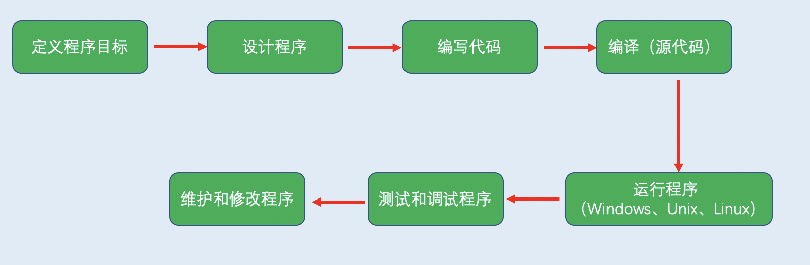

## 第一章 预备知识

### 👉【[复习题](./复习题.md)】【[编程练习题](./编程题.md)】

### 1、C++简介
C++融合了3种不同的编程方式：
- C语言代表的`过程性语言`
- C++在C语言基础上添加了类代表的`面向对象语言`
- C++模板支持的`泛型编程`

C++继承C语言高效、简洁、快速和可移植性的传统。

### 2、C++简史
#### 2.1 C语言编程：过程性语言
Bell实验室的Dennis Ritchie为了设计开发UNIX的通用性、可移植性等，在旧语言的基础上开发了C语言。

汇编语言依赖于计算机的内部机器语言，直接对硬件进行操作。

**数据**：程序使用和处理的信息。

**算法**：程序使用的方法。

C语言是**`过程性语言`**，强调编程的算法方面。一种结构化的编程方式。

C语言的新原则：**`自顶向下设计`**，理想：将大型程序`拆分`小型、便于管理的任务。

#### 2.2 面向对象编程
***`过程性语言（C语言）`强调`算法`，`OOP（C++、Java等）`强调`数据`***。

OOP不像过程性编程，其理念是设计与问题的本质特性相对应的数据格式。区别如下：

- `过程性语言（让问题来满足语言）`
- `OOP编程（让语言来满足问题）`

类规定了可使用哪些数据来表示对象以及可以对这些数据执行哪些操作。

**OOP程序设计方法**：先设计`类（可以明确表示程序要处理的东西）`，然后设计使用`类的对象的程序`。

从`低级组织（如类）`到`高级组织（如程序）`的处理过程叫作 `自下而上` 的编程思想。

OOP可以创建可重用的代码，减少大量的工作，信息隐藏可以保护数据，使其免遭不适当的访问。

#### 2.3  C++和泛型编程
泛型编程（generic programming）是C++支持的另一种编程模式。与OOP目标系统。

术语：`泛型（指创建独立于类型的代码）`。

**OOP与泛型编程的区别：** 
- `OOP`强调编程的`数据`方面，是`管理大型项目`的工具
- `泛型编程`强调`独立于特定数据类型`，提供`执行常见任务（如对数据排序或合并链表）`的工具。

### 3、可移植性和标准
#### 3.1 可移植性的两个障碍
- **硬件**：分块放置模块，通过重写模块，最大限度降低可移植性问题。
- **语言上的差异性**：国际组织定义了C语言标准、定义了C++99、C++11、C++14等标准。

### 4、程序创建的技巧

#### 4.1 编程步骤
更多编译细节请阅读【编译原理】

#### 4.2 常见的编译器
- Linux/UNIX ： GNU gcc/g++
- Windows ：软件IDE
- Mac OS ： Xcode自带g++和clang

