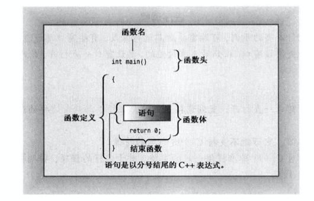

## 第二章 开始学习C++

### 👉【[复习题](./复习题.md)】【[编程练习题](./Codes)】

## 1. 进入C++
```cpp
/*第一个C++程序*/

#include <iostream>
using namespace std; /*定义一个可视化*/

int main(void)
{
    cout<<"Come up an C++"<<endl;
    cout<<"You won't regret it"<<endl;

    return 0;
}
```

对于一个C++ 程序主要包含以下元素：
- 注释：由前缀`//` 或者是 `/* */` 标识
- 预处理器编译指令`#include`
- 函数头：`int main() `
- 编译指令：`using namespace`
- 函数体：用`{ } `括起来
- 使用C++ 的`cout`工具显示消息的语句
- 结束`main()`函数的`return`语句

### 1.1、`main()`函数头
main() 被启动代码调用，而启动代码是编译器添加到程序中。
>函数头描述 `main()` 和OS（UNIX/Linux、Windows、mac os等）直接的`接口`。

`空括号的main()` 不接受任何参数。

```cpp
int main(void)
{
    statement
    return 0;
}
```
`main()`函数描述了函数的行为。同时也构成了两部分的 **`函数定义（function definition）`** ：第一行`int main()`函数叫做 **`函数头（function heading）`**，花括号({和})中包括的部分叫 **`函数体`**。

函数体：指出函数应做什么的计算机指令。

在C++中，每条完整的指令叫做`语句`。所有的语句都是以 `分号`结束。



`main()`中最后一条语句叫做 ` 返回语句（return statement）`，结束main()函数。 

⚠️注意：C++程序通常是以`main() `函数开始执行，如果没有，程序不完整，则`编译器会指出未定义main()函数`。
> 大小写都必须准确
>
> 不需要`main()函数`的特殊情况：
> 1. Windows中的`动态链接（DLL）`模块。
> 2. 单片机或机器人芯片

### 1.2、C++注释
C++中的注释以 **`双斜杠（//）`** 打头。以`行尾`作为结束。

**注释的作用**：为程序提供解释说明，使得程序通俗易懂。

通常标识程序的一部分或者是标识代码的某个方面。

**注意点**：编译器不会运行，会直接忽略注释。

C++也可以识别C语言的注释

C语言风格的注释
- **`多行注释`**：符号`/* `和 `*/` 之间，以 `*/` 作为注释的结束。
- **`单行注释`**：以 **`双斜杠（//）`** 开始，`行尾`作为结束。

### 1.3、预处理器和头文件
如果程序要使用C++输入或输出工具时，必须使用两行代码：
```cpp
#include <iostream>
using namespace std;
```

使用了 `#include`作为了预编译指令，也就是所谓的预处理器指令。
> 预处理器的操作：在源代码被编译之前，替换或添加文本。

例如：
```cpp
#include <iostream>
```
像iostream这样的文件叫做 **`包含文件（include file）`** ———— 也被包含在其他的文件中，所以也叫做 **`头文件（header file）` **。

头文件命名约定
|头文件类型|约定|示例|说明|
|:--:|:--:|:--:|:--:|
|C++旧式风格|以 `.h` 结尾|iostream.h|C++程序可以使用|
|C旧式风格|以 `.h` 结尾|math.h|C、C++ 程序可以使用|
|C++ 新式风格|没有扩展名|iostream|C++程序可以使用，使用namespace std;|
|转换后的C|加上前缀c，没有扩展名|cmath|C++ 程序可以使用，可以使用不是C的特性，如namespace std;|
 

### 1.4、名称空间（namespace）
如果程序中使用的是 `iostream` ，那么就需要使用名称空间编译指令来使得对程序可用。
```cpp
using namespace std;
```
也叫做 **using编译指令**。

### 1.5、使用cout进行C++的输出
```cpp
    cout<<"Come up an C++"<<endl;
    cout<<"You won't regret it"<<endl;
```

`双引号` 括起来的部分就是要打印的消息。

在C++中，使用`双引号`括起来的一系列字符叫做 **`字符串`**，由于若干个字符组合而成。

`<<` 指出信息流动的路径，cout是一个`预定义的对象`。


#### 初识运算符重载
<< 既可以是插入运算符，也可以是左移运算符。
> 典型的运算符重载的情况，通过重载，同一个运算符代表不同的含义。具体含义编译器会通过上下文来确定。

常见的运算符重载例子
- `&` ----> 既表示地址运算符，又表示按位AND运算符。
- `*` ----> 既表示乘法，也表示对指针解除引用。


#### 控制符`endl`
```cpp
cout<<endl;
```
endl 是C++中的一个特殊符号，作用：**重起一行**。

在输出流中插入`endl`使得屏幕光标移到下一行开头。

endl在头文件`iostream`中定义，且位于`名称空间std`中。

#### 换行符
C++也也提供了早期C语言表示换行的方法；C语言符号`\n`。

`\n` 被视为一个字符，名为`换行符`，也就是C++中的`endl的重起一行`。

显示字符串时，在字符串中包含换行符，而不是在末尾添加endl，可减少输入量。

```cpp
/*两个语法都是一样的，都是：重起一行*/
cout<<"\n";
cout<<endl;
```

### 1.6、C++源代码风格

C++中源代码的风格遵循以下规则：

- 每条语句各占一行。
- 每个函数都有一个`开始花括号`和一个`结束花括号`，两个花括号各占一行。
- 函数中的语句都相对于花括号进行缩进。
- 与函数名称相关的`圆括号周围没有空白`。

## 2. C++语句

程序代码例子：
```cpp
#include<iostream>
using namespace std;

int main()
{
    int carrots; // 声明一个整型变量

    carrots = 25; // 给变量赋值
    cout<<"我有 "<<carrots<<" 个carrots."<<endl;

    carrots = carrots - 1; // 对变量进行修改
    cout<<"快看！快看！现在，我有 "<<carrots<<" 个carrots!"<<endl;

    return 0;   
}
```

### 2.1 声明语句和变量

在C++中，**`首次使用变量时，必须声明`** 。可以避免因拼写错误而难以发现错误。

声明通常指出要存储的数据类型和程序对存储在内存里的数据使用的名称。

程序中的声明语句叫作`定义声明`语句，简称`定义`。定义会使得编译器为`变量分配内存`。

⚠️注意：声明不一定是定义。

### 2.2 赋值语句
赋值语句将值赋给存储单元。

符号 `= `叫作`赋值运算符`。👉 小Tips：C++中允许连续使用赋值运算符。

赋值是`从右向左`进行。

## 3. 其他C++语句

### 3.1 cin 和cout
`cin` 使用 `>>` 运算符从`输入`流中抽取字符。
> 可以将通过键盘输入的一列字符（即输入）转换为接收信息的变量能够接受的形式。

`cout` 的对象属性包含一个插入运算符 `<<` ，将右侧的信息插入到输出流中。
> << 运算符可以进行多条输出语句的拼接。

### 3.2 类的简介

类是C++ `面向对象编程（OOP）`的核心概念之一。

#### 什么是类？
类是用户定义的一种数据类型。

要定义类，需要描述它能够表示`什么信息`和`可对数据执行什么操作`。

类定义描述的是：`数据格式`及其`用法`，而`对象`则是根据`数据格式规范`创建的`实体`。

#### 两个类`cin类` 和 `cout类`

- `cin`类：`istream类对象`
- `cout`类：`ostream类对象`，`ostream类定义`描述了`ostream对象`表示的`数据`以及对它执行的`操作`。
> 两个类没有被内置到编译器中。
**注意点**：`类`描述了一种数据类型的`全部属性（包括使用它执行的操作）`，`对象`则是根据描述`创建的实体`。

#### C++中信息发送的方式
- 使用类方法（函数调用等）
- 重新定义运算符

## 4. 函数
两种C++函数
- 有返回值
- 无返回值

### 4.1 有返回值的函数
有返回值的函数将生成一个值，而值将赋值给变量或其他的表达式中使用。

- **被调用函数**：被调用的函数
- **调用函数**：包含调用的函数
- **返回值**：发送回的值

**`参数`** 是发送给函数的信息， **`返回值`** 是从函数中发送回去的值。

👉 **小Tips**：对于C++编译器而言，`函数的参数类型`和`返回值类型`必须`一致` 。

⚠️注意：C++程序应当为程序中使用的每个函数提供原型。
> 函数原型结尾必须以 `分号(;)` 结束。如果省略分号，编译器则认为是`函数头`，要求提供定义该函数的函数体。

**~~不要混淆函数原型和函数定义~~**
> `函数原型`只描述`函数接口`。
> 
> `函数定义`包含`函数的代码`。

👉 **小Tips**：`首次`使用函数之前`提供原型`，一般把原型放在 `main()函数定义`前面。

### 4.2 函数变体

- 在原型中使用关键字void来指定返回类型，指出函数没有返回值。
    ```cpp
    void bucks(double);
    ```
- 关键字void不接受任何参数。如果省略void，让括号为空，则C++解释为一个不接受任何参数的隐式声明。
    ```cpp
    int rand(void);
    ```

### 4.3 用户定义的函数

对于库函数，在使用之前必须提供其原型，通常把原型放在main()定义之前。

- 函数格式
函数格式为：`一个函数头 + 花括号的函数体`。
    ```cpp
    type functionname(arguementlist)
    {
        statements
    }
    ```
C++ ~~不允许将函数定义嵌套在另一个函数中~~，每个函数定义独立。


- 函数头
例如`main()`函数头。

⚠️注意：关键字是专用词，不能用作他用。
> return不能用作变量名，double不能用作函数名。

### 4.4 用户定义的有返回值的函数
有返回值的函数，使用`关键字return`来提供返回值，并结束函数。

#### 函数的特性
- 有函数头和函数体
- 接受一个参数
- 返回一个值
- 需要一个原型

### 4.5 在多函数程序中使用using编译指令
让程序访问名称空间std的4种方法
- 将 `using namespace std;` 放在`函数定义之前`，让文件种所有的函数都能够使用`名称空间std`中所有的元素。
- 将 `using namespace std;`  放在`特定的函数定义之前`，让该函数能够使用`名称空间std中`的所有元素。
- 在特定的函数中使用类似 `using std::cout`;编译命令，而不是 `using namespace std;` 让该函数能使用指定的元素，如cout。
- 完全不使用`编译指令using`，而在需要使用`名称空间std`中的元素是，使用前缀`std::`。
