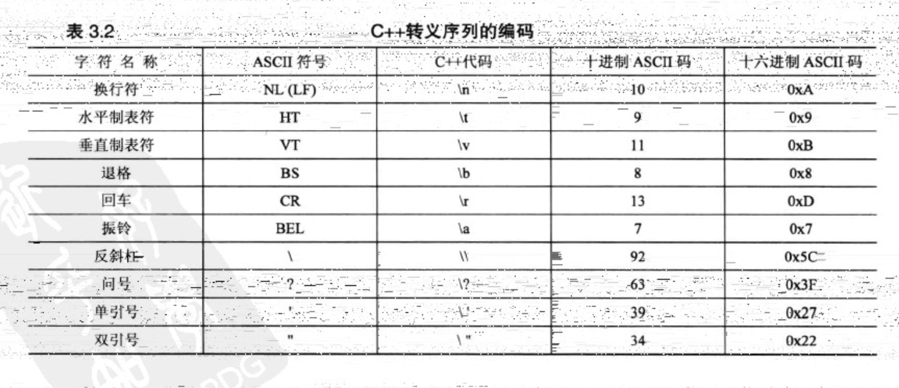
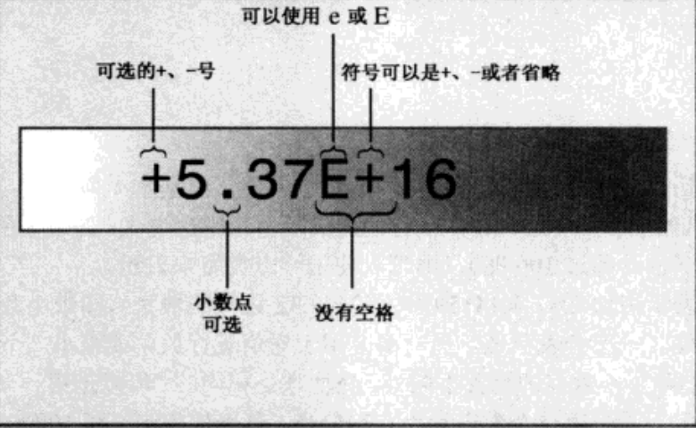
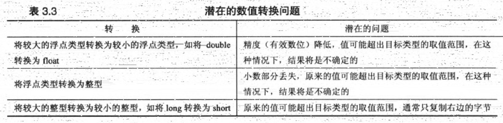

## 第三章 数据处理
### 👉【[复习题](./复习题.md)】【[编程练习题](./编程题.md)】
## 1. 简单变量

程序必须记录3个基本属性
- 信息将存储在哪里
- 要存储什么值
- 存储何种类型的信息

### 1.1 变量名
C++变量命名规则
- 变量名只能使用`字母字符`、`数字`和`下划线（_）`。
- 名称的`第一个`字符不能是`数字`。
- 区分大小写
- ~~不能将关键字用作名称~~
- 以`两个下划线`或`下划线`和`大写字母开头`的名称被保留给`实现（编译器及其使用的资源）`使用。以一个下划线开头的名称被保留给实现，用作`全局标识符`。
- 对名称长度没有限制，名称中所有字符都有意义。

✅ 小Tips:变量名建议使用 `驼峰式` 的格式。例如：myEyeTooth 或 my_eyes。

### 1.2 整型
整数：没有小数部分的数字。如：77、-120等。

C++中，不同的整型使用不同的内存量，使用的内存越大，可表示的数值范围越大。

整型分为：
- 正值
- 负值


### 1.3 整型short、int、long和long long

计算机内存的基本单元：**位（bit）** 。

**字节（byte）** 通常是8位的内存单元。字节指的是描述计算机计算机内存量的度量单位。

单位换算：
```cpp
1 KB = 1024 byte
1 MB = 1024 KB
```

在C++种也确保了类型的最小长度
- short 至少 16位
- int 至少和 short一样长
- long至少32位，且至少与int一样长
- long long 至少 64位，且至少与long一样长。

要知道系统中整数的最大长度，可以使用C++工具来检查类型的长度。

首先使用sizeof运算符返回类型或变量的长度，单位为字节。

climits中包含符号常量（预处理方式）来表示类型的限制。
```cpp
#include<iostream>
#include<climits> // 定义了符号常量来表示类型的限制
using namespace std;

int main()
{
    // 变量的初始化
    int n_int = INT_MAX;
    short n_short = SHRT_MAX;
    long n_long = LONG_MAX;
    long long n_llong = LONG_MAX;
    /**使用sizeof()运算符, 不是函数
     * 
     * 可对类型名（如int）或者是变量名（如n_short）使用，对变量名使用时，括号可有可无。
     */
    cout<<"int 是 "<<sizeof(int)<<" bytes "<<endl;
    cout<<"short 是 "<<sizeof n_short<<" bytes "<<endl;
    cout<<"long 是 "<<sizeof n_long<<" bytes "<<endl;
    cout<<"long long 是 "<<sizeof n_llong<<" bytes "<<endl;
    
    // 最大值
    cout<<"MAXIMUM Values:"<<endl;
    cout<<"int : "<<n_int<<endl;
    cout<<"short : "<<n_short<<endl;
    cout<<"long : "<<n_long<<endl;
    cout<<"long long : "<<n_llong<<endl;

    // 最小值
    cout<<"MINIMUM int value = "<<INT_MIN<<endl;
    cout<<"Bits per byte = "<<CHAR_BIT<<endl;

    return 0;
}

```
### 1.4 变量初始化问题
- 初始化将赋值和声明合并在一起。也可以使用`字面值常量`来初始化。也可以直接使用`表达式`来初始化变量。
```cpp
int variable00 = value;
int variable01 = value1 + value2;
int variable02(4);
```

- 如果不对函数内部定义的变量进行初始化，该变量的值不确定的。

- 将大括号初始化用于单值变量。
```cpp
int emus{7};
int rheas{12};
int var = {12};
```
> 大括号初始化器可用于任何类型（可以使用等号，也可以不使用），属于通用的初始化语法。
- 在大括号内也不包含任何东西。此时变量初始化为零。

- 变量的初始化的问题，有助于防范类型转换错误。

### 1.5 无符号类型
优点：可以增大变量能够存储的最大值。

创建无符号类型的变量时，只需要使用unsigned来进行声明即可。
> short变量加unsigned和没有unsigned，两者显示结果都是不一样的。
```cpp
unsigned int un_int = 100;
unsigned short u_sint = SHRT_MAX;
```

### 1.6 整型字面值
整型字面值（常量）：显式书写的常量。如777或者是222。

C / C++中的三种计数方法：
- 十进制（第一位为1～9，基数为10）----> dec
- 八进制（第一位为0，基数为8） ----> oct
- 十六进制（前两位以0x或0X开头，基数为16，0～9和a～f（A～F）的组合）----> hex
> 默认情况下，cout以`十进制形式`显示整数。

### 1.7 char类型：字符和小整数
char类型：专门存储`字符（如字母和数字）`，也是另外一种整型。

一般不超过128个字符，可以表示计算机系统中的所有基本符号 -----> 所有的字母、数字和标点符号等。

ASCII字符集中的字符用数值编码（ASCII码）进行表示。如字符A的编码为65。
 ```cpp
#include <iostream>
int main(void)
{
    char ch = 'M';
    std::cout <<"The ASCII code for "<< ch <<" is "<<int(ch)<<std::endl;
    std::cout.put(ch); /* . 句点被称为成员运算符*/
    std::cout << std::endl;
    return 0;
}
 ```
 > `成员函数cout.put()` ———— C++ OOP概念中的成员函数，成员函数归类所有，描述了操作数据的方法。

有些字符无法通过键盘输入到程序中，所以C++提供了特殊的表示方法 ----> `转义序列`。常见的如下



✅ 小Tips:在可使用数字转义序列或符号转义序列（如\0x8和\b）时，应使用符号序列。
> 数字表示与特定的编码方式（如ASCII码）相关，而符号表示适用于任何编码方式，其可读性也更强。

<u> 将转义序列作为字符常量时，使用单引号，如果放在字符串时，则使用双引号</u>
```cpp
cout << endl; /*使用endl重起一行*/
cout <<'\n'; /*字符串常量*/
cout <<"\n"; /*字符串*/
```


### 1.8 Bool类型
来源于数学表示法。

C++将`非零值`表示为`true`，将`零`表示为`false`。
```cpp
bool is_ready = true;
```

## 2. const限定符

符号名称指出了常量表示的内容。

`const关键字`来修改变量声明和初始化。常量被初始化后，其值就被`固定`，编译器将`不允许再修改`该常量的值。

将名称的`首字母大写`，以便提醒是个常量，可便于阅读性增强。如果是变量名全大写，则使用 `#define` 。

创建常量的通用格式为：
```cpp
const type name = value;
```

例如：
```cpp
const int Months = 12; // 一年有12个月
```
如果在声明const常量时没有提供值，该常量的值将是不确定，且无法更改。

## 3. 浮点数
浮点数就是表示小数点部分的数字。计算机将值分为两部分存储，一部分表示值，另一部分则用于对值进行放大或缩小。

### 3.1 为什么叫浮点数？
因为小数点可移动，所以称之为`“浮点数”`。

表示方法：

#### 第一种 使用常用的`标准小数点`表示法
```
3.14159
10.0
```

#### 第二种 表示浮点值的方法叫做`E表示法（科学计数法）`。
例如：
```
3.45E6 3.45与10的6次方相乘，E6代表的是10的6次方。
```

E适合表示`非常大`和`非常小`的数。



E表示法确保数字以浮点格式存储，即使没有小数点。

指数为负数意味着除以10的乘方，而不是乘以10的乘方。

8.33E～4表示:8.33 / 10的4次方,也就是：0.000833

**技巧**：
- d.dddE+n ———— 将小数点向右边移动n位
- d.dddE-n ———— 将小数点向左边移动n位

### 3.2 浮点数类型

根据可以表示的`有效数位`和`允许的指数最小范围`，可以分为3种浮点数类型：`float`、 `double`和`long double`。

### 3.3 浮点常量

在书写浮点常量的时候，加 `后缀` ， 以便区分何种类型，从而确定可表示的数值范围。例如：
```cpp
3.14f // float类型
3.14L // 长浮点型long double
```
### 3.4 浮点数优缺点
两个优点：
- 表示整数之间的值
- 有缩放因子

缺点：

浮点数运算的`速度`通常比`整数运算慢`，而且`精度`完全`降低`。

## 4. C++算术运算符
五种基本运算符进行基本的算术运算。

`加（+）、减（-）、乘（*）、除（/）、求模（%）`


运算符的优先级和数学中的优先级类似。

### 4.1 除法运算符问题的总结
除法运算符（/）的行为取决于操作数的类型。

如果两个操作数都是整数，则C++将执行整数除法。把结果的小数部分丢弃，使最后的一个结果是一个整数。

如果其中有一个（或两个）操作数是浮点数，则小数部分将保留，结果为浮点数。 

```cpp
#include<iostream>
using namespace std;

int main()
{
    // 如果编译器不接受self()中的ios_base,请使用ios。   
    cout.setf(ios_base::fixed,ios_base::floatfield);
    cout<<"整数消除： 10 / 5 = "<<10/5<<endl; /*输出结果：10 / 5 = 2*/
    cout<<"浮点数消除：10.0 / 5.0 = "<<10.0/5.0<<endl; /*输出结果：10.0 / 5.0 = 2.000000*/
    cout<<"浮点数消除：10.0 / 5 = "<<10.0/5<<endl; /*输出结果：10.0 / 5 = 2.000000*/
    cout<<"double常量：1.e7 / 9.0 = "<<1.e7 / 9.0<<endl; /*输出结果：1.e7 / 9.0 = 1111111.111111*/
    cout<<"浮点常量：1e7f / 9.0f = "<<1.e7f / 9.0f<<endl; /*输出结果：1e7f / 9.0f = 1111111.125000*/
    return 0;
}
```
运算符重载：使用相同的符号进行多种操作。


### 4.2 求模运算符
求模（求余）：返回`整数除法`的余数。

与整数除法结合，适用于解决要求讲一个量分成的整数单元的问题

⚠️注意：~~`浮点数`没有求模运算~~。

### 4.3 类型转换
类型转换的规则
- 将一种算术类型的值赋给另一种算术类型的变量时，C++对值转换为接收变量的类型。
- 表达式中包含不同的类型时，C++对值进行转换
- 将参数传递给函数时，由函数原型控制，C++对值进行转换

数值转换中存在的潜在问题



类型的强制转换

**强制转换本身不会修改变量本身，而是创建一个新的、指定类型的值**。

强制转换的通用格式如下：
```cpp
(typename) value //来源于C语言
typename (value) // C++
```

### 4.4 C++11中的`auto`声明
在初始化声明中，如果使用`关键字auto` 时，而`不指定变量的类型`，编译器将把变量的类型设置成与初始值相同。
```cpp
auto n = 100; /*自动设置为int类型*/
auto x = 1.15; /*自动设置为double类型*/
```
