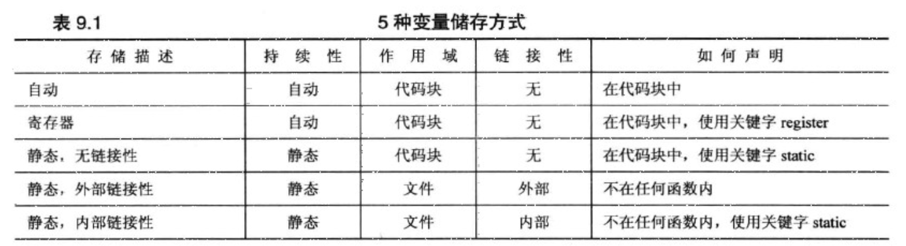

## 第 9 章 内存模型和名称空间

## 👉【[复习题](./复习题.md)】【[编程练习题](./编程题.md)】

## 1. 单独编译
C++鼓励将组件函数放在独立的文件中。可单独编译文件，然后将其链接成可执行的程序。
> C++编译器既编译程序，也管理链接器。

C++都将一些结构声明或结构函数原型都放在头文件中，然后使用 `#include` 指令来管理头文件。（⚠️注意：不是包含源代码文件）

~~不要将函数定义或变量声明放到头文件中，简单场景无问题，大型场景会引发问题~~ 。

头文件中包含的内容
- 函数原型
- 使用`#define`或`const`定义的符号常量
- 结构声明
- 类声明
- 模板声明
- 内联函数

在同一个文件中只能将同一个头文件包含一次。例如，可能使用包含了另外一个头文件的头文件，为了避免这种情况，可以采用以下一种技术`#ifndef #define…..#endif`。

## 2. 存储持续性、作用域和链接性

C++中使用了四种不同的方案来存储数据，它们的区别在于`数据保留在内存中的时间`。

### 2.1 作用域和链接

作用域描述了名称在文件的多大范围可见。

链接性描述了名称如何在不同单元间共享。链接性为外部的名称可在文件间共享，链接性为内部的名称只能由一个文件中的函数共享。

C++变量的作用域的种类
- 局部的变量只在定义它的代码块使用（函数体）
- 全局（文件作用域）的变量在定义位置到文件结尾直接都可用。
- 自动变量的作用域为局部。
- 静态变量的作用域取决于如何被定义。
- 函数原型中的名称只在包含参数列表的括号内可用
- 类中声明的成员的作用域为整个类。
- 名称空间中声明的变量作用域为整个名称空间。

### 2.2 自动存储持续性
在`函数定义中`声明的变量（包括函数参数）的存储持续性为`自动`的。程序执行其`所属的函数`或`代码块`时被创建，在执行完后被释放。**自动变量的名称没有链接性，因为不能共享**。
> 作用域为局部，没有链接性。
 
### 2.3 静态存储持续性
在`函数定义外`定义的变量和使用`关键字static`定义的变量的存储持续性为`静态`，它们在程序整个运行过程中都存在.

提供了3种链接性：
- `外部链接性`：代码块的外面声明
    - 单定义规则：变量只能有一次定义。
    - C++提供了两种变量声明：
        - 定义声明：给变量分配存储空间。
        - 引用声明：不给变量分配存储空间（引用已有的变量）。引用声明使用`关键字extern`，且不进行初始化。
    - 如果多个文件中要使用外部变量，只需一个文件中包含该变量的定义（单定义规则），使用该变量的其他文件中，都必须使用关键字extern 声明。

- `内部链接性`：在代码块的外面声明，且使用static限定符。
    - 在其所属的文件中使用。
- `无链接性`：代码块内使用，且使用static限定符。
    - 一般是在函数内使用，尽管函数之间多次被调用，其值不会发生变化。

> 所有静态持续变量在整个程序执行期间都存在。



除默认的`零初始化`外，可对静态变量进行`常量表达式初始化`和`动态初始化`。

### 2.4 线程存储持续性（C++11特性）
在多核处理器中，这些CPU可以同时处理多个执行任务，这让程序能够将计算机放在可并行处理的不同线程中，如果变量是使用`关键字thread_local声明`的，则其生命周期与所属的线程一样长。

### 2.5 动态存储持续性
用`new运算符`分配的`内存一直存在`，直到使用`delete`运算符将其`释放`或程序结束为止，这种内存有时被称为自由存储或堆。


### 2.6 说明符和限定符
存储说明符
- `auto（C++11中不是说明符）`：用于自动类型推断
- `register`：声明中指示寄存器存储，C++11中显式指出变量是自动。
- `static`：内部链接性，作用域为整个文件的声明中。主要使用静态局部变量。
- `extern`：引用声明，声明引用在其它地方定义的变量。
- thread_local（C++11新增）：指出变量的持续性与其所属线程的持续性相同。
- mutable：即使结构（或类）变量为const，其某个成员也可以被修改。
- `volatile`：程序代码没有对内存单元进行修改，其值可能发生变化。

### 2.7 存储方案和动态分配
使用C++运算符`new（或C函数malloc()）`分配的内存，称为`动态内存`。
> 动态内存由`new` 和 `delete` 控制。而不是作用域和链接性规则控制。

编译器的三块独立内存：`静态变量、自动变量、动态存储`。

- 使用new运算符初始化
如果为内置的标量类型分配存储空间并初始化，可在类型名后面加上初始值，将其用括号括起。
```cpp
int *pi = new int (6);
```
要初始化常规结构或数组，需要使用大括号的列表初始化。

- new失败时
早期返回空指针，现在会触发异常std::bad_alloc。

- new和delete
运算符new和new[]分别调用如下函数：

```cpp
void * operater new(std::size_t);
void * operater new[](std::size_t);
```
称为分配函数，对应的释放函数如下：

```cpp
void operator delete(void *);
void operator delete[](void *);
```

- 定位new 运算符

new的两个功能：
1. 在堆中找到足以满足的内存块。
2. 指定要使用的位置（定位特性）。
    > 使用new定位特性，需要包含 `头文件new`。

## 3. 名称空间
在C++中，名称可以是`变量、函数、结构、枚举、类以及类和结构的成员`。

解决名称空间冲突的问题。

### 3.1 传统的C++名称空间
**声明区域**：声明所在区域。

**潜在作用域**：变量的潜在作用域从`声明点`开始，到其声明区域的`结尾`。

### 3.2 新的名称空间特性

通过定义一个新的声明区域来创建命名的名称空间 ---- 目的：提供一个声明名称的区域。避免名称空间中的名称之间发生冲突。

默认情况下，名称空间中的声明的名称是外部链接。
> 名称空间可以是全局，也可是另一个名称空间，但不能是位于代码块中。

#### 3.2.1 访问名称空间中的方法
- 通过`作用域解析运算符::`，使用名称空间来限定使用。
- C++机制（`using声明`和`using编译指令`）来简化对于名称空间中的名称使用。
    - using声明：仅名称空间中的特定的名称可用，通过作用域解析运算符进行。
    - using编译指令：使整个名称空间中的名称可用。
```cpp
using std::cout;
```
一般情况下，使用`using声明`比使用`using编译指令`更安全。

利用`namespace`来创建声明区域，用`using`关键字来使用。

## 4. 名称空间的一些指导原则
- 使用在已命名的名称空间中声明的变量，而不是使用`外部全局变量`或`静态全局变量`。
- 如果开发了一个`函数库`或`类库`；将其放在一个名称空间中。事实上，C++当前提倡将标准函数库 
放在名称空间std中，这种做法扩展到了来自C语言中的函数。例如，`头文件math.h` 是与C语言 
兼容的，没有使用名称空间，但`C++头文件cmath`应将各种数学库函数放在名称空间std中。实 
际上，并非所有的编译器都完成了这种过渡。
- 仅将`编译指令using`作为一种将旧代码转换为使用名称空间的权宜之计。
- ~~不要在头文件中使用using编译指令~~。首先，这样做掩盖了要让哪些名称可用；另外，包含头文 
件的顺序可能影响程序的行为。如果非要使用`编译指令using`,应将其放在所有`预处理器编译指令 
#include`之后.
- 导入名称时，首选使用`作用域解析运算符`或`using声明`的方法。
- 对于`using声明`，首选将其`作用域`设置为`局部`而~~不是全局~~。
