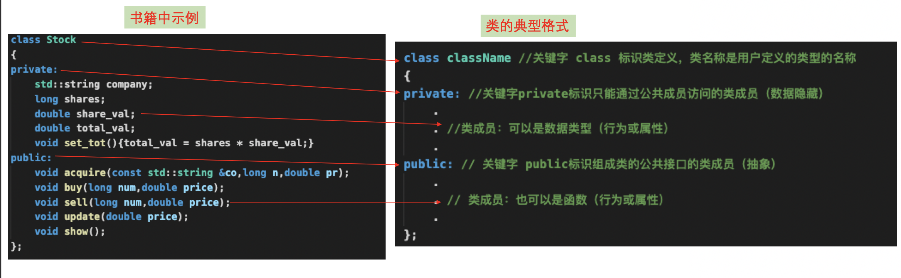

<h1 align="center">第 10 章 对象和类 学习笔记</h1>

### 👉【[复习题](./复习题.md)】【[编程练习题](./编程题.md)】

## 00. OOP的特性
面向对象编程（OOP）的特性：
- 抽象
- 封装和数据隐藏
- 多态
- 继承
- 代码的可重用性

## 01. 过程性和面向对象两种编程的区别
- 过程性编程
首先要考虑遵循的步骤，然后考虑如何表示这些数据（不需要程序一直运行。将数据存储到一个文件中，然后从文件中读取数据）。

- OOP编程
优先考虑数据（需要考虑如何表示数据，还要考虑如何使用数据）


## 02. 抽象和类
抽象和简化是处理复杂性问题的方法之一。

抽象是通往用户定义数据类型的捷径，在C++中，用户定义类型指的是 **`实现抽象接口的类设计`**。

### 2.1 类型是什么？
指定基本类型的三项工作：
- 决定数据对象需要的内存数量。
- 决定如何解释内存中的位
- 决定可使用数据对象执行的操作或方法

对内置类型有关的操作信息被内置到编译器中，而在C++中用户自定义的类型，则必须自己提供类型信息。

## 2.2 C++中的类
类是一种将抽象转换为用户定义类型的C++工具。将数据表示和操作数据的方法组合成一个包。

一般来说，类规范由两个部分组成：
- 类声明：提供类的蓝图
    > 以数据成员的方式描述数据部分，以成员函数（被称为方法）的方式描述公有接口。

- 类方法定义：提供细节
    > 描述如何实现类成员函数。

接口是一个共享框架，供两个系统交互时使用。

对于类（公共接口）的public 是使用类的程序，交互系统由类对象组成，而接口由编写类的人提供的方法组成。

***`要使用某个类，必须了解其公共接口；要编写类，必须创建其公共接口`***。

🚩 小Tips：C++程序员将`接口（类定义）`放在`头文件`中，将`实现（类方法的代码）`放在`源代码文件`中。

#### 2.2.1 类的定义


👉 说明：不必在类声明中使用关键字 private，因为这是类对象的默认访问控制。

类设计尽可能将共有接口与实现细节分开。
- 公有接口表示设计的抽象组件。
    - 将实现细节`放在一起`并将其与抽象分开称为`封装`。
- 数据隐藏（将数据放在类的私有部分中）是一种封装。
    - 将实现的细节`隐藏在私有部分`中。
    - 优点：防止直接访问数据，让使用类的用户无需了解数据如何表示。

对于C++程序而言，一般使用类来实现类描述，将结构限制为只表示纯粹的数据对象。

无论类成员是数据成员还是成员函数，都可以在类的公有部分或私有部分中声明使用。但由于隐藏数据是OOP的目标之一，所以数据项一般放在私有部分，组成类接口的成员函数放在公有部分，否则无法从程序中调用这些函数。


## 2.3 实现类成员函数
创建类描述的第二部分：类声明中的原型表示的成员函数提供代码。成员函数与常规函数类似，但有特殊的特征：
- 定义成员函数时，使用`作用域解析运算符（::）`来标识函数所属的类。例如
    ```cpp
    void  Stock::update(double price);
    ```
- 类方法可访问类的private组件。

作用域解析运算符确定了方法定义对应的类的身份。
> 类中的其它成员函数互相使用彼此，不需要解析操作符，而在类声明和方法定义之外使用时，则需要使用。


定义位于`类声明中的函数`都将自动称为`内联函数`，类声明通常将短小的成员函数作为内联函数。也可在`类声明之外`定义成员函数，通过在`类实现部分中定义函数时`使用`inline限定符`使其成为内联函数。
> 内联函数一般也放在头文件中。

```cpp
class Stock
{
    private：
        ...
        void set_tot(); // 类声明内定义，但会转换为内联函数
    public：
        ...
};

inline void Stock::set_tot() //直接使用inline限定符将其变为它是类Stock的成员函数
{
    total_val = shares * shares_val;
}
```

要使用新类型，最关键是需要了解成员函数的功能，而不必考虑其实现细节。

### 2.4 小结
指定类设计的两个步骤：
- 提供类声明
    - 声明私有部分：声明的成员只能通过成员函数进行访问。
    - 声明公有部分：声明的成员可被使用类对象的程序直接访问。
    > 通常，数据成员放在私有部分，而成员函数放在公有部分。
- 实现类成员函数
    _ 在类声明中提供完整的函数定义、而不是函数原型。

## 03. 类的构造函数和析构函数
一般来说，最好在创建对象时对其自动进行初始化。
```cpp
Stock gift;
gift.buy(10,24.75);
```

C++提供一种特殊的成员函数 ------> **`类构造函数`**：专门用于构造新对象、将值赋给对应的数据成员。
> C++为成员函数提供名称和使用语法，而程序员需要提供方法定义。

⚠️注意：构造函数没有声明类型。


### 3.1 构造函数
C++使用构造函数来初始化对象的两种方式：
- 显式调用构造函数
    ```cpp
    Stock food = Stock("Tencent",20,450);
    ```
- 隐式调用构造函数
    ```cpp
    Stock garment("Furry Mason",50,2.5);
    // 与下面的显式调用等价
    Stock garment = Stock("Furry Mason",50,2.5);
    ```
每次创建类对象（甚至使用new动态分配内存）时，C++都使用类构造函数。

`构造函数被用来创建对象，而不能通过对象来调用`。

默认构造函数时在未提供显式初始值时，用来创建对象的构造函数。例如：
```cpp
Stock fluffy_the_cat; //默认构造函数
```
如果没有提供任何构造函数，则C++将自动提供默认构造函数（隐式版本吗，不做任何工作）。

默认构造函数没有参数，因为声明中不包含值。当且仅当没有定义任何构造函数时，编译器才会提供默认构造函数。
> 如果要创建对象，而不显式地初始化，则必须定义一个不接受任何参数的默认构造函数。

定义默认构造函数的方式有两种
- 给已有构造函数的所有参数提供默认值
    ```cpp
    Stock(const std::string & co = "Error",int n = 0,double pr = 0.0);
    ```
- 通过函数重载来定义另一个构造函数 ---- 一个没有参数的构造函数
    ```cpp
    Stock();
    ```
由于只能有一种默认构造函数，所以不能同时采用这两种方式。

程序例子code -----> 「[Stock00](./stock00)」

### 3.2 析构函数
用析构函数创建对象后，程序负责跟踪该对象，直到其过期为止。对象过期时，程序会自动调用一个特殊的成员函数 ---- **`析构函数`**。
> 析构函数主要是完成清理工作。只需要让编译器生成一个什么都不做的隐式析构函数即可。

析构函数`没有参数`，在类名前加上` ～`，所以其原型如下：
```cpp
~Stock();
```
析构函数不承担任何重要的工作，所以将它编写为不执行任何操作的函数。
```cpp
Stock::~Stock()
{
    cout<< "Bye, " << company << "\n";
}
```

析构函数的调用
- `静态存储类对象`：在程序`结束时`自动被调用。
- `自动存储类对象`：在程序`执行完代码块时`自动被调用。
- `new创建的对象`：将驻留在栈内存或自由存储区，`使用delete来释放内存时`，将自动被调用。
- `临时对象`：将在`结束对该对象的使用时`自动调用析构函数。

由于类对象过期时析构函数将自动被调用，因此必须有一个析构函数。
> 如果程序中没有提供析构函数，编译器将隐式地声明一个默认析构函数，并发现导致对象被删除的代码后，提供默认析构函数的定义。

程序例子code -----> 「[Stock10](./stock10)」

👉 小 Tips：`如果既可以通过初始化，也可通过赋值来设置对象的值，则是优先选择初始化方式`。

const成员函数，保证函数不会修改调用对象。C++的解决方法：将const关键字放在函数的括号后面。
```cpp
void show() const; //声明

void Stock::show() const; //函数定义的开头
```
只要类方法不修改调用对象，就应该将其声明为const。

对于析构函数来说，可以`没有返回类型（连void也没有）`，也`没有参数`，其名称为`类名称`前加上 `~`。

## 04. this指针
this指针指向用来调用成员函数的对象（this被作为隐藏参数传递给方法）。所有的类方法都将this指针设置为调用它的对象的地址。
> 使用 `->运算符` 来访问类成员。

注意点
- 每个成员函数（包括构造函数和析构函数）都有一个this指针。this指针指向调用对象。如果方法需要引用整个调用对象，则可以直接使用表达式 *this。
在函数的括号后面使用const限定符将this限定为const，此时不能使用this来修改对象的值。

- 由于this是对象的地址，因此返回的不是this，而是对象本身，即 *this（将解除引用运算符 * 用于指针，将得到指针指向的值）。


程序例子code -----> 「[Stock20](./stock20)」

## 5. 对象数组
声明对象数组的方法与声明标准类型数组相同。如：
```cpp
Stock mystuff[4]; //声明对象数组，其中包含了4个Stock对象的数()

const int STKS = 10;
Stock stocks[STKS] = {
    Stock("NanoSmart",12.5,20), //stock[0]
    Stock(), //使用构造函数Stock()来初始化stock[1]
    Stock("Nanolithic Obelisks",120,3.25) // stock[2]
};
// 使用 Stock(const std::string &co ,long n,double pr)初始化 stock[0] 和 stock[2]。其余的7个元素则使用默认构造函数来进行初始化。
```

初始化对象数组的方案：
> 要创建对象数组，则类必须有默认构造函数。
1. 使用默认构造函数创建数组元素
2. 花括号中的构造函数将创建临时对象
3. 将临时对象的内容复制到相应的元素中。

## 6. 类作用域
在类中定义的名称（如数据成员名和类成员函数名）的作用域味都为整个类，作用域为整个类的名称只在该类中已知，在类外不可知。因此可在不同类中使用相同的类成员名称而不会引起冲突。

类作用域意味着不能用外部直接访问类的成员（包括公有成员函数），则必须通过对象来调用公有成员函数。在定义成员函数时，必须使用作用域解析运算符。

```cpp
Stock sleeper("Exclusive Ore",100,0.25); // 创建对象
sleeper.show();// 使用对象去调用公有成员函数
show(); //不可用，因为不能直接调用方法

// 定义成员函数，使用作用域解析运算符
void Stock::update(double price)
{
    ......
}
```

在类声明或成员函数定义中，可使用未修饰的成员名称（未限定的名称），构造函数名称在被调用时，才能被识别（名称与类名称相同）。在其他的情况下，使用类成员名时，必须根据上下文使用`直接成员运算符（.）`、`间接成员运算符（->）`或`作用域解析运算符（::）`。例子：

```cpp
class Ik
{
    private:
        int fuss; //有类作用域
    public:
        Ik(int f = 9){fuss = f;} // fuss在类作用域内
        void ViewIk() const;
}；

void Ik::ViewIk() const //作用域解析运算符使用
{
    std::cout << fuss << std::endl; //fuss在作用域内调用类方法
}
...
int main()
{
    Ik * pik = new Ik;
    Ik ee = Ik(8); //构造函数在作用域内，则有类名
    ee.ViewIk(); // 类对象将ViewIK引入到作用域内（直接成员运算符）
    pik -> ViewIk(); // 间接产成员运算符
    ...
}
```

### 6.1 作用域为类的常量
使符号常量的作用域为类很有用。例如，类声明可能使用字面值30来制定数组的长度。由于该常量对于所有对象来说都相同，则创建爱你一个由所有对象共享的常量也不错。你以为如下方式可行：
```cpp
class Bakery
{
    private:
        const int months = 12;// 声明常量？直接FAILS
        double costs[months];
        ...
}
```
直接不可行！！！！原因：声明类只是描述对象的形式，并没有创建对象（创建对象前，将没有用于存储值的空间）。

C++提供了两种方式在类中定义常量：
- 使用`关键字static`
    ```cpp
    class Bakery
    {
        private:
        // 直接在声明前使用关键字static，将常量直接与其他静态存储变量存储在一起，而不是存储在对象中
            static const int months = 12;
            double costs[months];
            ...
    }
    ```

- 在`类中声明一个枚举`
    ```cpp
    class Bakery
    {
        private:
            //枚举不会创建类数据成员，所有对象不包含枚举，months只是一个符号名称，编译器遇到它时会直接将值替换
            enum {months = 12}; 
            double costs[months];
            ...
    }
    ```
 
## 7. 抽象数据类型
**`抽象数据类型（Abstract Data Type，ADT）`**：以通用的方式来描述数据类型，而没有引入语言或实现细节。

类很适合用于描述ADT，公有成员函数接口提供了ADT描述的服务，类的私有部分和类方法的代码提供了实现（实现对类的用户隐藏）。
