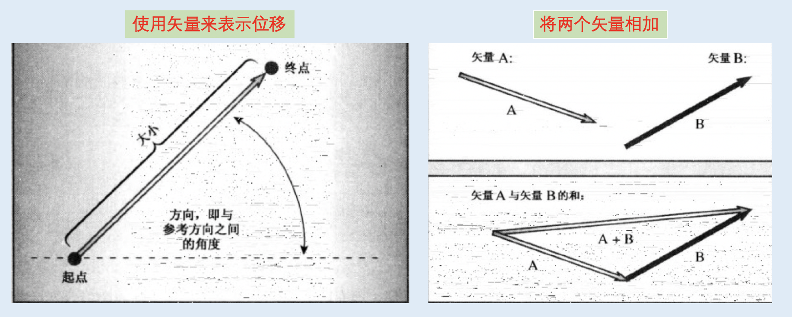

<h1 align="center">第 11 章 使用类 学习笔记</h1>

### 👉【[复习题](./复习题.md)】【[编程练习题](./编程题.md)】

## 01. 运算符重载
操作符重载（Operator Overloading）是一种形式的C++多态。

### 1.1 概述
**`函数重载（函数多态）`**：定义多个名称相同但特征标（参数列表）不同的函数。
> 函数重载（function overloading）、函数多态（function polymorphism）。

C++允许将运算符重载扩展到用户定义的类型。要重载运算符，需使用被称为运算符函数的特殊函数形式。运算符函数的格式如下：

```cpp
// op表示要重载的操作符符号，如 operator +()
operator op(argument-list)

// 如：operator []() 数组索引运算符
```
op必须是有效的C++运算符，不能虚构一个新的操作符号。

⚠️警告：不要返回指向局部变量或临时对象的引用。函数执行完毕之后，局部变量和临时对象将消失，引用将指向不存在的数据。


示例代码 ----> 「[mytime00 版本code](./mytime00)」

在添加了加法运算符重载的问题后，「[mytime10 版本code](./mytime10)」

### 1.2 重载限制
- 重载后的运算符必须至少有一个是用户定义的类型。目的：防止用户对标准类型重载运算符。
- 使用运算符时，不能违反运算符原来的句法规则。不能改变优先级。
- 不能创建新运算符。如： operator **() 函数表示求幂（❌不允许）
- **`不能重载`**下面的运算符
    - `sizeof`运算符
    - `成员`运算符（`.`）
    - `成员指针`运算符（`.*`）
    - `作用域解析`运算符（`::`）
    - `条件`运算符（`:?`）
    - 一个`RTTI`运算符（`typeid`）
    - 强制类型转换运算符（`const_cast、dynamic_cast、reinterpret_cast、static_cast`）。

- 只能通过`成员函数重载`的操作符
    - `赋值`运算符（`=`）
    - `函数调用`运算符（`()`）
    - `下标`运算符（`[]`）
    - 通过`指针访问类成员`的运算符（`->`）

将常见的操作符进行重载，具体例子：「[mytime20 版本code](./mytime20)」

## 2. 友元简介
C++提供另外一种形式的访问权限：友元。友元有3种：
- 友元函数
- 友元类
- 友元成员函数

通过让函数成为类的友元，可以赋予该函数与类的成员函数系统的访问权限。

在为`类重载二元运算符时`（带两个参数的运算符）常常需要友元。

对于非成员重载运算符函数来说，运算符表达式左边的操作数对应于运算符函数的的第一个参数，运算符表达式右边的操作数对应于运算符函数的第二个参数，而原来的成员函数则按相反的顺序处理操作数。

通过友元函数，可以让非成员函数也可与类成员函数相同的访问权限。

### 2.1 创建友元
- 创建原型

    创建`友元函数`，将其原型`放在类声明`中，并在`原型声明前加上关键字 friend`：

    ```cpp
    friend Time operator * (double m,const Time & t)
    /** operator*() 函数是在类声明中声明的，但不是成员函数，因此不能使用成员运算符来调用
     * operator*() 函数不是成员函数，但它与成员函数的访问权限相同
     */
    ```

- 编写函数定义
    因不是成员函数，所以不需要使用 `Time::` 限定符。**`不要在定义中使用关键字 friend`**。
    ```cpp
    Time operator*(double m, const Time & t) // 友元不用在函数定义中使用
    {
        Time result;
        long totalminutes = t.hours * mult * 60 + t.minutes * mult;
        result.hours = totalminutes / 60;
        result.minutes = totalminutes % 60;
        return result;
    }
    ```

### 2.2 常用的友元：重载 `<< 运算符`
`<<运算符`是C和C++的`位运算符`，将值中的位左移。`ostream类`对该运算符进行重载，将其转换为一个输出工具。

`ostream类声明`中都包含相应的重载的 `operator<<()`定义。

```cpp
ostream & operator <<(ostream & os, const c_name & obj)
{
    os << ...; // 显示内容
    return os;
}
```

⚠️警告：只有在类声明中的原型才能使用` friend 关键字`。除非函数定义也是原型，否则不能在函数定义中使用该关键字。

## 3. 重载运算符：作为成员函数还是非成员函数
对于很多运算符来说，可选择使用成员函数或非成员函数来实现运算符重载。而非成员函数则必须是友元函数才能访问类的私有数据。

```cpp
// ---------------- Time 类 --- 注意：加法属于二元操作符（需要两个操作数）-----
Time operator+(const Time & t) const; //成员函数版本（一个操作数通过this指针隐式磁道没，而另一个则是作为函数参数显式传递）

friend Time operator+(const Time & t1,const Time & t2);// 非成员函数版本（友元函数，两个操作数都是作为参数传递）
```

⚠️注意：非成员版本的重载运算符函数所需的形参数目与运算符使用的操作数数目相同；而成员函数所需的参数数目少一个，因为其中的一个操作数是被隐式地传递的调用对象。

```cpp
T1 = T2 + T3;

T1 = T2.operator+(T3); // 成员函数格式
T1 = operator+(T2,T3); //非成员函数格式
```

⚠️注意：在定义运算符是，必须选择其一，而不能同时选择两种格式，否则会出现二义性，从而导致编译错误。

## 4. 重载示例：矢量类
使用运算符重载和友元的类设计 ----- 一个表示矢量的类。

`矢量（vector）`是工程和物理中使用的一个术语，是有`大小`和`方向`的量。计算机科学版本的 vector模板类在 第 16 章。



程序代码中的示例 ------> 「[vector 矢量概述的代码示例](./vector)」

## 5. 类的自动转换和强制类型转换

将一个标准类型变量的值赋给另一种标准类型的变量时，如果两种类型兼容，则C++自动将该值转换为接收变量的类型。但是也会伴随精度丢失的情况发生。

### 5.1 两种类型转换
在无法完成自动转换时，可以使用强制类型转换。

- 隐式转换
    ```cpp
    //使用构造函数创建一个临时对象并初始化，然后采用逐成员赋值的方式将临时对象的内容复制到myCat中，这种方式称为隐式转换。
    Stonewt(double lbs);
    Stonewt myCat;
    myCat = 19.6;
    // 只有接受一个参数的构造函数才能作为转换函数
    ```
    隐式转换是自动进行，而不需要显式强制类型转换。

- 显式转换
    
    将构造函数用于自动类型转换会出现意外情况，所以C++新特性使用 `关键字 explicit` 来关闭自动特性。
    ```cpp
    // 声明构造函数的格式
    explicit Stonewt(double lbs); //不隐式转换（显式转换）
    ```
    

只接受`一个参数的构造函数`定义了从`参数类型`到`类类型`的转换。如果在声明中使用`关键字 explicit`，则只用于`显式强制类型转换`。否则会用于如下的隐式转换。（避免存在`二义性`）
- 将Stonewt对象初始化为doubel值时
- 将double值赋给Stonewt对象时。
- 将double值传递给接受Stonewt参数的函数时。
- 上述任一情况下，使用可转换为double类型的内置类型时。

### 5.2 转换函数
C++运算符函数 ----- 转换函数：用户自定义的强制类型转换，可进行类似使用内置强制类型转换一样的方式。

```cpp
operator typeName(); // typeName指要转换成的类型

operator double(); //转换为double类型的函数原型
```
**⚠️转换函数的注意点**：
- 必须是类方法：需要通过类对象来调用，从而告知函数要转换的值。
- 不能指定返回类型
- 不能有参数

> **转换函数没有返回类型、没有参数、但必须返回转换后的值（虽然没有声明返回值的类型）**

**C++为类提供的类型转换**
- 只有`一个参数的类构造函数`用于将类型与该参数相同的值转换为类类型。在构造函数声明中使用 `explicit`可防止隐式转换，而只允许显式转换。
- 被称为`转换函数`的特殊类成员运算符函数，用于将类对象转换为其他类型。
