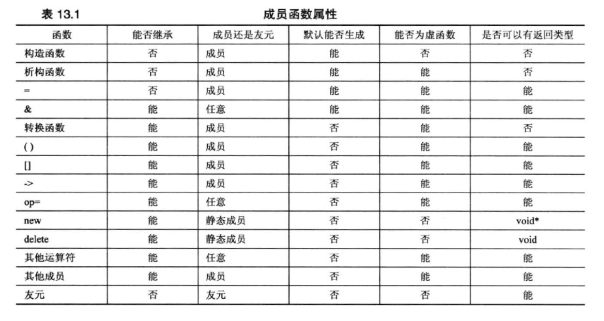

<h1 align="center">第 13 章 类继承 学习笔记</h1>

### 👉【[复习题](./复习题.md)】【[编程练习题](./编程题.md)】

C++类提供了类库来提高重用性。类库由类声明和实现构成，以源代码的方式提供，所以要修改满足不同的需求，就需要修改代码。

C++提供`类继承`来扩展和修改类。类继承从已有的类派生出新的类，而派生类继承原有类（基类）的特征，包括方法。


继承可以完成的工作
- 在已有类的基础上添加功能
- 可给类添加数据
- 可修改类方法的行为

## 1. 基类
从一个类派生出另一个类时，`原始类`称为`基类`，`继承类`称为`派生类`。

继承的声明格式（公有继承）：
```cpp
//public表面声明是一个公有基类，公有派生类
class leaves : public root
{
    ......
}

// 书中例子
class RatePlayer : public TableTennisPlayer //基类（原始类）：TableTennisPlayer，派生类（继承类）：RatePlayer
{
    ......
}
```

派生类对象（上述code中的RatePlayer）的特征：
- 派生类对象存储了基类的数据成员（派生类继承了`基类的实现`）
- 派生类对象可以使用基类的方法（派生类继承了`基类的接口`）

### 1.1 构造函数：访问权限的考虑
⚠️注意：派生类不能直接访问基类的私有成员，而必须通过基类公有方法来进行访问私有的基类成员。具体来说，派生类构造函数必须使用基类构造函数。

`派生类构造函数`的要点
- 创建派生类首先创建基类对象
- 派生类构造函数应通过成员初始化列表将基类信息传递给基类构造函数
- 派生类构造函数应初始化派生类新增的数据成员。

```cpp
RatedPlayer::RatedPlayer（unsigned int r,const string &fn,const 
                         string &ln,bool ht）:TableTennisPlayer(fn,ln,ht) // :TableTennisPlayer(fn,ln,ht) 是成员初始化列表
{
   rating=r;
}
```

派生类对象的释放顺序与创建对象时的顺序相反（首先执行派生类的析构函数目，然后自动调用基类的析构函数）。

### 1.2 派生类和基类之间的特殊关系
- `派生类对象`可以使用`基类的方法`，条件是`方法不是私有`的。
- `基类指针`可以在`不进行显式类型转换`的情况下`指向派生类对象`。
- `基类引用`可以在`不进行显式类型转换`的情况下`引用派生类对象`。

```cpp
// 基类：TableTennisPlayer，派生类：RatedPlayer
RatedPlayer rplayer(1140, "Mallory", "Duck", true);
rplayer.Name(); //通过基类方法来继承
TableTennisPlayer & rt = rplayer;
TableTennisPlayer * pt = &rplayer;
rt.Name(); // 使用引用方式来引用派生类对象
pt->Name(); //指针方式来指向派生类对象
```
`基类指针`或`引用`只能用于调用`基类方法`。因此，不能使用 rt 或 pt来调用派生类的 ResetRanking 方法。

C++中要求引用和指针类型与赋给的类型匹配，但这规则对于继承来说是一种单向例外，不可以将基类对象和地址赋给派生类引用和指针。

如果基类引用和指针可以指向派生类对象，则如下情况均可正常使用：
- 基类引用定义的函数或指针参数可用于基类对象或派生类对象。
    - 形参为基类引用时，可指向基类对象或派生类对象。
    - 形参为指向基类的指针的函数，可使用基类对象的地址或派生类对象的地址作为实参。
- 引用的兼容性问题允许将基类对象初始化为派生类对象。
- 可将派生类对象赋给基类对象。


## 2. 继承：is-a关系

C++中3种继承方式：
- 公有继承
- 保护继承
- 私有继承

公有继承是最常用的方式，建立一种 `is-a` 关系。即派生类对象也是一个基类对象，可对基类对象执行的任何操作，也可对派生类对象执行。

## 3. 多态公有继承
多态：同一个方法的行为随上下文而异。

实现多态公有继承的两种机制：
- 在派生类中重新定义基类的方法
- 使用虚方法

使用 `virtual` 方法，程序会根据`引用或指针指向的对象的类型`来选择方法，而不是根据`引用或指针类型`来选择方法。

如果要在派生类会重新定义基类的方法，通常将基类方法声明为虚的。即在`类方法`声明前加上 `virtual` 关键字。被virtual声明的类方法称为`虚方法`。

```cpp
class BrassPlus:public Brass
{
    private:
        ......
    public:
        ......
        virtual void ViewAcct() const; //虚方法
        virtual void Withdraw(double amt); // 虚方法
}
```

## 4. 静态联编和动态联编
`函数名联编`：将源代码中的函数调用解释为执行特定的函数代码块。

`静态联编（早期联编）`：在`编译过程中`进行联编。

`动态联编（晚期联编）`：编译器生成能够在`程序运行时选择正确的虚方法`的代码。

### 4.1 指针和引用类型的兼容性
- `向上👆强制转换`：将派生类引用或指针 ---------> 基类引用或指针。⚠️公有继承不需要进行显式类型转换。
    > 向上强制转换是可传递的。

- `向下👇强制转换`：将基类指针或引用 ---------> 派生类引用或指针。如果不使用显式类型转换，则向下强制转换不允许使用。

- 隐式向上强制转换使基类指针或引用可以指向基类对象或派生类对象，因此需要动态联编。C++虚成员函数来能满足这种需求。

### 4.2 虚成员函数和动态联编
编译器对`非虚方法`使用`静态联编`，而对于`虚方法`使用动态联编。

- 有两种类型联编的原因？
    - 效率

        动态联编为使程序可在程序运行阶段进行决策，则必须采取一些方法来跟踪基类指针或引用指向的对象类型，但会增加额外的处理开销。此时静态联编效率更高。

        C++的指导原则之一：不要为不适用的特性付出代价。仅当程序设计确实需要虚函数时，才使用它们。

    - 概念模型


- 虚函数的工作原理
C++规定了虚函数的行为，实现方法还是需要由编译器作者负责。

编译器处理虚函数的方法：给每个对象添加一个`隐藏成员`。隐藏成员中保存了一个`指向函数地址数组`的指针。这种数组称为`虚函数表（Virtual function table，vtbl）`。虚函数表中存储了为类对象进行声明的虚函数的地址。

使用虚函数时，在内存和执行速度方面存在的成本：

- 每个对象都将增大，增大量为存储地址的空间；

- 对于每个类，编译器都创建一个虚函数地址表（数组）；

- 对于每个函数调用，都需要执行一项额外的操作，即到表中查找地址。

### 4.3 虚函数的注意事项
- 在基类方法的声明中使用`关键字 virtual`，可使该方法在基类以及所有派生类（包括派生类的方法）都是虚的。

- 如果使用`指向对象的引用或指针`来`调用虚方法`，程序将使用对象类型定义的方法，而不使用为引用或指针类型定义的方法。这称为`动态联编`或`晚期联编`。

- 如果定义的类将被用作基类，则应将要在派生类中重新定义的类方法声明未为虚的。

#### 4.3.1 构造函数
**构造函数不能是虚函数**。派生类不继承基类的构造函数，所以将构造函数声明为虚的无意义。

#### 4.3.2 析构函数
**析构函数应声明为虚函数**，除非类不用做基类。

即使基类不需要显式析构函数提供服务，也不应依赖于默认构造函数，而 **应提供虚构函数，即使它不执行任何操作**。

#### 4.3.3 友元
**友元不能是虚函数**，因为设计的问题，友元不是类成员，而是通过让友元函数使用`虚成员函数`来解决。

#### 4.3.4 没有重新定义
如果`派生类没有重新定义函数`，将使用`函数的基类版本`。如果`派生类位于派生链`中，则将使用`最新的虚函数版本`。

#### 4.3.5 重新定义将隐藏方法
重新定义不会生成函数的两个重载版本，而是隐藏了基类版本。

- 如果重新定义继承的方法，应确保与原来的原型完全相同，但如果返回类型是基类引用或指针，则可以修改为指向派生类的引用或指针，这种特性称为 `返回类型协变（Covariance of return type）`。
    > 允许返回类型随类型的变化而变化。⚠️注意：**只适用于返回值，不适用于参数**。

- 如果基类声明被重载，则应在派生类中重新定义所有的基类版本。

## 5. 访问控制：protected
**控制对类成员访问权限的三个关键字：`private、public、protected`**。

关键字 `protected` 和 `private`类似，在`类外`只能使用`公有类成员`来访问 `protected 部分中的类成员`。

private和protected的区别：派生类成员直接访问基类的保护成员，但不能直接访问基类的私有成员。

对外部而言，保护成员的行为与私有成员类似，对派生类来说，保护成员的行为与公有成员类似。

```cpp
// Brass类将balance成员声明为保护的
class Brass
{
    protected:
        double balance;
        ...
};
```
⚠️警告：最好对数据成员采用私有访问控制，不要使用保护访问控制，同时通过类方法使得派生类能够访问基类数据。

对成员函数来说，保护控制可以让派生类能够访问公众无法使用的内部数据。

## 6. 抽象基类
在类声明中包含纯虚函数时，则该类就是**`抽象基类（Abstract Base Class，ABC）`**。

C++通过使用`纯虚函数（pure virtual function）`提供`未实现的函数`。纯虚函数声明的结尾处为`=0`。

```cpp
class BaseEllipse //抽象基类
{
    private:
        ...
    public:
        ...
        virtual double Area() const = 0; //纯虚函数
};
```
如果在类声明中包含纯虚函数时，则不能创建该类的对象。

ABC描述的是至少使用一个纯虚函数的接口，从ABC派生出的类将根据派生类的具体特征，使用常规虚函数来实现接口。
[]
ABC要求具体派生类覆盖其纯虚函数 -

## 7. 继承和动态内存分配
如果派生类也使用动态内存分配（使用new和delete进行），有如下几个技巧：

### 7.1 情况1:派生类不使用new
假设基类使用动态内存分配：
```cpp
// Base Class Using DMA(Dynamic Memory Allocation)
class BaseDMA
{
    private:
        char *label;
        int rating;
    public:
        baseDMA(const char * l = "null", int r = 0);
        baseDMA(const baseDMA & rs); // 复制构造函数（处理内存分配）
        virtual ~baseDMA(); //虚析构函数
        baseDMA & operator=(const baseDMA & rs); //赋值运算符重载
        ......
};
```
如果在基类中已经使用了动态内存分配（已定义显式析构函数、复制构造函数和赋值运算符），则在派生类中无需使用动态内存分配。
```cpp
// derived class without DMA
class lackDMA:public baseDMA
{
    private:
        char color[40];
    public:
        ......
};
```
此时的派生类lackDMA类不需要定义显式析构函数、复制构造函数和赋值运算符。

### 7.2 情况2:派生类使用new
如果基类和派生类也使用了动态内存分配：
```cpp
class hasDMA: public baseDMA
{
    private:
        char * style; // 构造函数中使用new
    public:
        ......
};
```
此时需要为派生类定义显式析构函数、复制构造函数和赋值运算符。对应的定义方法如下：

- 析构函数

    派生类析构函数自动调用基类的析构函数，故其自身职责：对派生类构造函数执行工作的清理。
    ```cpp
    baseDMA::~baseDMA()
    {
        delete [] label;
    }
    hasDMA::~hasDMA()
    {
        delete [] style;
    }
    ```

- 复制构造函数

    复制构造函数只能访问自身的数据，不能访问基类的私有数据，所以必须调用基类的复制构造函数来进行数据共享。
    ```cpp
    // 成员初始化列表将hasDMA引用传递给baseDMA构造函数。
    hasDMA::hasDMA(const hasDMA & hs):baseDMA(hs) //基类引用可以指向派生类型。
    {
        style = new char[std::strlen(hs.style) + 1];
        std::strcpy(style,hs.style);
    }
    ```
    所以，baseDMA复制构造函数将使用hasDMA参数的baseDMA部分来构造新对象的baseDMA部分。

- 赋值运算符

    派生类的显式赋值运算符必须负责将所有继承的baseDMA基类对象的赋值，可通过显式调用基类赋值运算符来进行该操作。
    ```cpp
    hasDMA & hasDMA::operator=(const hasDMA & hs) //hasDMA使用DMA，所以需要一个显式复制运算符
    {
        if(this == &hs)
            return *this;
        baseDMA::operator=(hs); // 与 *this = hs 相同
        delete [] style;
        style = new char[std::strlen(hs.style) + 1];
        std::strcpy(style, hs.style);
        return *this;
    }
    ```

### 7.3 总结

当基类和派生类都采用动态内存分配时，派生类的析构函数、复制构造函数、赋值运算符都必须使用相应的类方法来处理基类元素。三种方式来满足：
- 析构函数：`自动`完成
- 构造函数：通过在`初始化成员列表`中调用基类的复制构造函数来完成。否则会自动调用基类的默认构造函数。
- 赋值运算符：通过 `作用域解析运算符` 来显式调用基类的赋值运算符来完成。

### 7.4 DMA和友元的继承
由于友元函数不能被继承，但是派生类应该如何使用基类的友元函数？
```cpp
// 基类baseDMA的友元函数
friend std::ostream * operator<<(std::ostream & os, const baseDMA & rs)
// 派生类hasDMA的友元函数
friend std::ostream & operator<<(std::ostream &os,const hasDMA & rs);
```
hasBMA可访问style成员，但不能访问基类baseDMA友元中的label和rating，所以通过使用基类baseDMA类的友元函数 operator<< 来对其进行强制类型转换，便于原型匹配选择正确的函数。

```cpp
std::ostream & operator<<(std::ostream & os, const hasDMA & hs)
{
	os << (const baseDMA &) hs; //直接通过强制类型转换的方式来进行
	os << “Style: ” << hs.style << endl;
	return os;
}
```


关于继承和内存动态分配的代码例子 -------> 「[继承和DMA 例子Code](./dma_and_friend_inheritence)」

## 8. 类设计回顾
C++可用于解决各种类型的编程问题，但不能将类设计简化成带编号的例程。

### 8.1 编译器生成的函数
编译器会自动生成一些公有成员函数 -----> 特殊成员函数。
- 默认构造函数

    - 默认构造函数要么没有参数，要么所有的参数都有默认值。

    - 如果没有定义任何构造函数，编译器将定义默认构造函数，便于创建对象。

    - 如果在派生类构造函数中成员初始化列表中没有显式调用基类构造函数，则编译器将使用基类的默认构造函数来构造派生类对象的基类部分。
        > 如果基类此时没有构造函数，将导致编译错误。
    - 构造函数的作用：确保对象总能被正确的初始化。

- 复制构造函数

    复制构造函数接受其所属类的对象作为参数。使用复制构造函数的情况：
    
    - 将新对象初始化为一个同类对象。
    - 按值将对象传递给函数。
    - 函数将值返回对象。
    - 编译器生成临时对象。

    如果程序没有使用，则编译器提供原型，但不提供函数定义。

- 赋值运算符

    - 默认的赋值运算符用于处理同类对象之间的赋值。
        > **`初始化`**：语句创建新的对象；**`赋值`**：语句修改已有对象的值。
    - 编译器不会生成将一种类型赋给另一种类型的赋值运算符，所以要么显式定义，要么使用强制类型转换。前者容易导致编译器出现混乱，所以一般使用后者。

- 默认析构函数


### 8.2 定义类（设计类）需要注意的问题
- **`构造函数`**
    
    用于创建新的对象，其他类方法只是被现有的对象调用，所以不能被继承。

- **`析构函数`**

    如果使用new进行动态内存分配，则一定要定义显式析构函数来完成类对象执行后的清理。基类应提供一个虚析构函数（即使不执行任何操作）。 

- **`转换`**
    C++11支持用explicit。使用explicit允许进行显式转换，禁止隐式转换。

- **`按值传递对象与传递引用`**：

    编写使用对象作为参数的函数时，应`按引用传递对象`（不使用按值传递）。原因如下：
    
    - 提高效率
    - 在继承使用虚函数时，被定义为接受基类引用参数的函数可以接受派生类。

    如果不修改引用，则将参数声明未const引用。

- **`返回对象和返回引用`**

    - 唯一区别：函数原型和函数头。
    - 应返回引用而不是返回对象的原因：返回引用可节省时间和内存。
    - ⚠️注意：函数不能返回临时对象的引用 -----> 函数结束，临时对象消失，所以引用不合法。

- **`使用const`**

    - 修饰参数 -----> 确保方法不修改参数。
    - 修饰方法 -----> 确保方法不修改调用它的对象。
    - 修饰返回引用的函数 -----> 确保引用或指针返回的值不能用于修改对象中的数据。

### 8.3 公有继承的考虑因素
- is-a关系

    遵循 is-a 关系，如果派生类不是特殊的基类，则不要使用公有派生。

- 什么不能被继承？
    - 构造函数
    - 析构函数
    - 赋值运算符

- 私有成员与保护成员
    - 将基类成员设置私有可提高安全性，设置保护可简化代码编写，提高访问速度。
    - 但一般将基类的数据成员设为私有成员，而将方法设置为保护成员。

- 虚方法

    在设计基类时，必须确定是否将类方法声明为虚的。
    - 如果派生类需要重新定义方法，则在基类中将方法设置为虚的。
    - 如果不需要，则不必将其声明为虚的。

- 析构函数
    - 基类的析构函数应是虚的（virtual）。

- 友友函数
    
    友元函数不是类成员，所以不能被继承。
    - 如果希望派生类的友元能使用基类的友元，可通过强制类型转换符。
        > 将派生类引用或指针转换为基类引用或指针，然后使用转换后的来调用基类的友元。

### 8.4 类函数的总结


