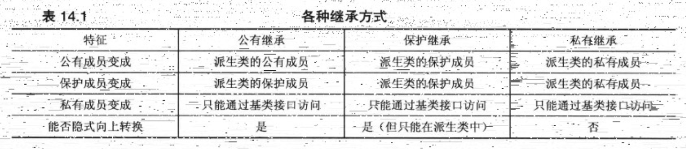

<h1 align="center">第 14 章 C++中的代码重用 学习笔记</h1>

### 👉【[复习题](./复习题.md)】【[编程练习题](./编程题.md)】

- [1. 包含对象成员的类](#1-包含对象成员的类)
  - [1.1 valarray类简介](#11-valarray类简介)
  - [1.2 Student类的设计](#12-student类的设计)
  - [1.3 接口和实现](#13-接口和实现)
  - [1.4 C++和约束](#14-c和约束)
- [2. 私有继承](#2-私有继承)
  - [2.1 私有继承和组合的异同](#21-私有继承和组合的异同)
  - [2.2 初始化基类组件](#22-初始化基类组件)
  - [2.3 访问基类的方法](#23-访问基类的方法)
  - [2.4 访问基类对象](#24-访问基类对象)
  - [2.5 访问基类的友元函数](#25-访问基类的友元函数)
  - [2.5 使用组合还是私有继承](#25-使用组合还是私有继承)
- [3. 保护继承](#3-保护继承)
- [4. 使用using重新定义访问权限](#4-使用using重新定义访问权限)
- [5. 多重继承(MI)](#5-多重继承mi)
  - [5.1 MI可能带来的问题](#51-mi可能带来的问题)
  - [5.2 程序worker的分析](#52-程序worker的分析)
- [6. 类模板](#6-类模板)
  - [6.1 定义类模板](#61-定义类模板)
  - [6.2 使用模板类](#62-使用模板类)
  - [6.3 数组模板和非类型参数](#63-数组模板和非类型参数)
  - [6.4 模板多功能性](#64-模板多功能性)
  - [6.5 模板的具体化](#65-模板的具体化)
  - [6.6 成员模板](#66-成员模板)
  - [6.7 使用模板作为参数](#67-使用模板作为参数)
  - [6.8 模板类和友元](#68-模板类和友元)
  - [6.9 模板别名（C++11）](#69-模板别名c11)

C++的主要目标：促进代码重用。通过公有继承来实现这种目标机制。

## 1. 包含对象成员的类
通过动态内存分配来表示数组，使得数组长度不被限制。

### 1.1 valarray类简介
`valarrat类` 由`头文件 valarray `支持。valarray被定义为一个模板类，以能够处理不同类型的数据类型。

模板特性意味着声明对象时，必须指定具体的数据类型。所以。valarray类来声明一个对象时，需要在`标识符valarray`后面加上`一对尖括号`，并在其中包含所需的数据类型。

```cpp
double gpa[5] = {3.1,3.5,3.8,2.9,3.3}       
valarray<double> v1;                    // double类型数组，大小为0
valarray<int> v2(8);                    // 8个int类型的元素数组
valarray<int> v3(10,8);                 // 8个int类型的元素数组，每个设置为10
valarray<doubl> v4(gpa,4);              // 4个元素数组，初始化
valarray<int> v5 = {20,32,17,9};        // 在C++11中，用来初始化列表
```

可以创建长度为0的数组、指定长度的空数组、所有元素被初始化为指定值的数组、用常规数组中的值来进行初始化的数组。

valarray类的一些方法：
- `operator[]()`：访问各个元素
- `size()`：返回包含的元素个数
- `sum()`：返回所有元素的总和
- `max()`：返回最大的元素
- `min()`：返回最小的元素

### 1.2 Student类的设计
学生和其它类之间不是 `is-a关系`，而是 `has-a关系`。学生有姓名和一组考试分数。

`has-a 关系`的C++技术是组合（包含），即创建一个包含其他类对象的类。

```cpp
class Student
{
    // 声明私有数据成员
    private:
        string name;                // 使用string对象
        valarray<double> scores;    // 使用 valarray<double> 对象
        ...
    // 成员函数可以使用 公有接口 来修改 name和 scores对象。但在类的外部不可行（通过Student类的公有接口来访问）
}
```

### 1.3 接口和实现
- 使用`公有继承`时，**`类可以继承接口`**。还会有`实现`（基类的纯虚函数提供接口，但不提供实现）
  - `获得接口`是 `is-a `关系的组成部分。

- 使用`组合`，类可以获得实现，但不能获得接口。
  - `不继承接口`是 `has-a` 关系的组成部分
  - `has-a` 关系上，类对象不能自动获得被包含对象的接口。

### 1.4 C++和约束
C++包含让程序员限制程序结构的特性 ---- 使用 explicit 防止单参数构造函数的隐式转换。使用 const限制方法修改数据等。

原因：在编译阶段出现错误优于在运行阶段出现错误。

## 2. 私有继承
实现 `has-a` 关系的另外一个途径 ---- **`私有继承`**。

使用私有继承，基类的公有成员和保护成员都将成为派生类的私有成员。意味着基类方法将不会成为派生对象公有接口的一部分，但可在派生类的成员函数中使用。

派生类不基础基类的接口。

### 2.1 私有继承和组合的异同
- 相同点
  - 私有继承
    - 获得实现，但不获得接口。
    - 将对象作为一个未被命名的继承对象添加到类中。
  - 组合
    - 将对象作为一个命名的成员对象添加到类中。

- 不同点
    - 类将继承实现
    - 组合提供两个被显式命名的对象成员。
    - 私有继承提供两个无名称的子对象成员。
    - 组合使用对象名来调用方法
    - 私有继承使用类名 和 作用域解析运算符来调用方法。

要进行私有继承，使用关键字 `private` 而不是 `public` 来定义类。

### 2.2 初始化基类组件
隐式继承组件而不是成员对象，会影响代码的编写。所以使用公有继承。

```cpp
// 使用组合的构造函数，直接使用成员名来标识构造函数
Student(const char * str, const double * pd , int n)
    : name(str),scores(pd,n) {} 

// 使用继承类，使用类名而不是成员名来标识构造函数
Student(const char * str, const double *pd, int n)
    : std::string(str), ArrayDb(pd,n) {} // ArrayDb 是 std::valarray<double> 的别名
```


### 2.3 访问基类的方法
使用私有继承时，只能在派生类的方法中使用基类的方法。

- 在私有继承使得使用`类名`和`作用域解析运算符`来调用`基类的方法`
- 组合是直接使用对象名来调用方法。


```cpp
double Student::Average() const
{
  if (ArrayDb::size > 0)
    return ArrayDb::sum / ArrayDb::size();
  else
    return 0;
}
```

### 2.4 访问基类对象
通过`强制类型转换`。将Student对象转换为string对象。

`指针this` 指向用来调用方法的对象，因此 `*this` 为用来调用方法的对象。

```cpp
const string & Student::Name() const
{
  return (const string &) *this; // 返回一个引用，引用指向用于调用方法的Student对象中的继承而来的string对象。
}
```

### 2.5 访问基类的友元函数
用类名显式地限定函数名不适合友元函数。 **友元不属于类**，但是可以通过显式转换为基类来调用正确的函数。

```cpp
ostream & operator<<(ostream & os, const Student & stu)
{
  os << "Scores for " << (const string &) stu << " : \n";
  ...
}
```

### 2.5 使用组合还是私有继承
多数选择程序员选择使用 **`组合`**。原因：
- 易于理解。
  - 类声明中组合表示被包含类的显式命名对象。代码可以通过名称引用对象
  - 继承会使得关系更抽象难懂。
- 继承会引起很多问题
  - 组合可以包含多个同类的子对象。
  - 继承只能使用一个对象（当对象都没有名称时，会难以区分）。


通常情况下：
- 应使用组合来建立 `has-a` 关系
- 如果新类需要访问原有类的`保护成员`，或者需要`重新定义虚函数`，则应使用`私有继承`。

## 3. 保护继承
保护继承是私有继承的变体。

在基类中使用 **`关键字protected`** 来进行声明。

```cpp
class Student : protected std::string, protected std::valarray<double>{
  ...
};
```
使用保护继承时，基类中的公有成员和保护成员都会变成派生类的保护成员。

- 使用 **`私有继承`** 时，第三代类将不能使用基类的接口。
  - 基类的公有方法在派生类中将变成私有方法。
- 使用 **`保护继承`** 时，基类的公有方法在第二代中将变成受保护的，所以第三代派生类可以使用。




## 4. 使用using重新定义访问权限
使用保护派生或私有派生时，基类的公有成员将成为保护成员或私有成员。

让基类的方法在派生类外可用的两种方式：
- 定义一个使用该基类方法的派生类方法
- 将函数调用包封装在另一个函数调用中。通过`using声明`来指出派生类可以使用特定的基类成员。（类似 using namespace std; 名次空间的方式）

`using` 声明只使用`成员名` ---- **`没有圆括号、函数特征标和返回类型`**。

```cpp
class Student : private std::string, private std::valarray<double>
{
  ...
  public:
    using std::valarray<double>::min;
    using std::valarray<double>::max;
    ...
};
```

## 5. 多重继承(MI)
使用多个基类的继承被称为 **`多重继承（multiple inheritance，MI）`** 。

MI描述的是`is-a`关系。

MI必须使用 `关键字public` 来限定每一个基类。原因：非特别指出，编译会认为是私有派生。

```cpp
// 从Singer 和 Waiter 公有派生出SingerWaiter
class SingerWaiter : public Waiter, public Singer {...};
// Singer 和 Waiter 都继承了一个 Worker组件，所以SingerWaiter则组合两个Woker组件
```

例子1 ： [代码](./workers0-code)

### 5.1 MI可能带来的问题
- 从两个不同的基类基础同名方法
- 从两个或者更多基类那里继承了同一个类的多个实例


### 5.2 程序worker的分析
把基类指针设置为派生对象中的基类对象的地址，有两种地址可选择，应使用类型转换来指定对象。

```cpp
Worker *pw1 = (Waiter *) &ed;
Worker *pw2 = (Singer *) &ed;
```

- 虚基类
  - 虚基类使得从多个类（基类相同）派生出的对象只继承一个基类对象。在类声明中使用关键字 `virtual` 来指示派生时，基类则成为`虚基类`。
  - C++在基类是虚的时，禁止信息通过中间类自动传递给基类。
  - 如果不希望`默认构造函数`来构造`虚基类对象`，则需要显式地调用所需的基类构造函数。
  
如果类有间接虚基类，则除非只需要使用该虚基类的默认构造函数，否则必须显式地调用该虚基类的某个构造函数。

在多重继承中，每个直接祖先都有`一个相同的函数`（如Show()），使得派生类调用此函数时`存在二义性`。此时需要使用`作用域解析运算`符来澄清编程者的意图。

```cpp
SingerWaiter newhire("Elise Hawks",2005,6,soprano)
newhire.Singer::Show();
```

- 如果基类是虚基类，派生类将包含基类的一个子对象。
- 如果基类不是虚基类，派生类将包含多个子对象。

如果类从不同的类哪里继承了两个或者更多的同名成员（数据或方法）则使用该成员名时，通过使用虚基类，某个名称优先于其他所有名称，则使用，如果不使用限定符，也不会导致二义性。

## 6. 类模板
C++模板提供参数化（parameterised）类型：能够让类型名作为参数传递给接收方来建立类或函数。

### 6.1 定义类模板
模板类的代码定义：

```cpp
template <typename Type> // 模板类型
template <class Type> // 模板类
```
- `template` 告诉编译器，将要定义一个模板，尖括号中的内容相当于函数的参数列表。
- 关键字 `class` 看作变量的类型名，变量接受类型作为其值，把Type看作是该变量的名称。
- Type 表示一个通用的类型说明符。在使用模板时，使用实际的类型替换它。

如果在类声明中定义了方法（内联定义），则可以省略模板前缀和类限定符。

模板类不是函数，不能单独编译。

模板必须和特定的`模板实例化`请求一起使用。一般是使将所有模板信息放在`一个头文件`中。

### 6.2 使用模板类
声明模板类的`对象`，必须`显式地提供所需的类型`。
```cpp
Stack<int> kernels; // 存储int类型的栈类
```

### 6.3 数组模板和非类型参数
```cpp
template <class T, int n>
```
- class 指出T为`类型参数`，int指出n的类型。这种参数称为`非类型（non-type）`或`表达式参数`。
- 表达式参数可以是`整型`、`枚举`、`引用`或`指针`。

**`模板代码不能修改参数的值，也不能使用参数的地址。`**

实例化模板时，用做表达式参数的值必须是`常量表达式`（`#define`或者`const`定义的常数）。


- 表达式参数的优缺点
  - 优点
    - 构造函数使用new和delete来管理堆内存，但它为自动变量维护的内存栈，使得执行速度更快。
  - 缺点
    - 每种数组大小都会生成自己的模板。

### 6.4 模板多功能性
模板类的三个功能：
- 用作基类
  ```cpp
  template <typename Type>
  class GrowArray : public Array <Type> {...};
  ```

- 用作组件类
  - 模板可以包含多个类型参数。
    ```cpp
    template <class T1, class T2>
    {
      private:
        T1 a;
        T2 b;
      public:
        T1 & first();
        T2 & second();
        ...
    };
    ```
- 默认类型模板参数
  - 可以为类型参数提供默认值
    ```cpp
    template <class T1, class T2 = int> class Topo {...};
    // 如果省略了T2的值，编译器会默认使用 int
    ```
  - 不能为`函数模板参数`提供默认值。但可为`非类型参数`提供默认值。

### 6.5 模板的具体化
`隐式实例化`、`显式实例化`和`显式具体化`，统称为 **`具体化`** 。

`模板`使用 `泛型` 的方式`描述类`，`具体化`是使用`具体化的类型`生成`类声明`。

- 隐式实例化
  - 声明一个或多个对象，指出所需的类型，而编译器使用通用模板提供的处方生成具体的类定义。

    ```cpp
    ArrayTP <int, 100> stuff;
    ```
- 显式实例化
  - 当使用关键字 template 并指出所需类型来声明类时，编译器将生成类声明的显式实例化。
  - 声明必须位于模板定义所在的名称空间中。
    ```cpp
    template class ArrayTP<string, 100>; // 虽然没有创建或提及类对象，编译器也将生成类声明（包括方法定义）
    ```

- 显式具体化
  - 格式如下：
    ```cpp
    template <> class Classname <specialized-type-name> {...};
    // 显式具体化的例子
    template <> class Pair<int,int> {...};
    ```

- 部分具体化
  - 部分限制模板的通用性。
    ```cpp
    // 通用模板
    template <class T1, class T2> class Pair {...};
    // 
    template <class T1> class Pair<T1,int> {...}; // T1 保持不变，但是T2 被具体化为 int
    ```
  - 关键字 `template` 后面的 `<>声明` 的是没有被具体化的类型参数。
  - 如果多个模板可供选择，编译器将优先使用具体化程度最高的模板。
  - 如果提供的类型不是指针，则编译器将使用通用版本。
  - 日过提供的是指针，则编译器将使用指针具体化版本

### 6.6 成员模板
模板可用作结构、类或模板类的成员。

```cpp
// template member
#include <iostream>
using std::out;
using std::cin;
using std::endl;

template <typename T>
class beta
{
  private:
    template <typename V> // 
    class hold
    {
      private:
        V val;
      public:
        hold(V v = 0) : val(v) {}
        void show() const {cout << val << endl; }
        V value() const {return val;}
    };
    hold<T> q;    // template object
    hold<int> n; // template object
  public:
    beta(T t, int i) : q(t), n(i) {}
    template<typename U> // template method
    U blab(U u,T t) {return (n.Value() + q.Value() * u / t;}
    void Show() const {q.Show(); n.Show();}
};
```
模板可以嵌套，所以语法为：
```cpp
template <typename T>
  template <typename V>
// 不能使用如下语法
template<typename T, typename V>
```

### 6.7 使用模板作为参数
模板可以包含 **类型参数（typename T）** 和 **非类型参数（int n）**。

示例：
```cpp
template <template <typename T> class Thing>
class Grab
```
- 模板参数是 template<typename T> class Thing，其中template <typename T> class 是类型，Thing 是参数。

### 6.8 模板类和友元
模板类声明也可以友元。模板的友元分为3类：
- 非模板友元
  - 在模板类中声明的一个常规友元函数，称为模板所有实例化的友元。
    ```cpp
    template<class T>
    class HasFriend
    {
      public:
        friend void counts();
        ...
    };
    ```
  - 当为友元函数提供模板类参数，必须指明具体化。
    ```cpp
    template <class T>
    class HasFriend
    {
      friend void report(HasFriend<T> &);// 具体化之后，就会变成约束模板友元
    };
    ```
- 约束模板友元：友元的类型取决于类被实例化时的类型。
  - 在`类外声明`的模板`具体化`。
  - 2个步骤：
    - 在类定义的前面声明每个模板函数
      ```cpp
      template <typename T> void counts();
      template <typename T> void reports(T &);
      ```
    - 在函数中再次将模板声明为友元。根据类模板参数的类型声明具体化。
      ```cpp
      template <typename TT>
      class HasFriendT
      {
        friend void counts<TT>();
        friend void report <HasFriendT<TT> &>;
        ...
      };
      ```

- 非约束模板友元：友元的所有具体化都是类的每一个具体化的友元。
  - 在`类内部`声明模板，可以创建`非约束友元函数`。
    ```cpp
    template <typename T>
    class ManyFriend
    {
      template <typename C,Typename D> friend void show2(C &, D &)
      ...
    };
    // 实现使用方式
    template <typename C, typename D> void show2(C & c, D & d)
    {
      ...
    }
    ```

### 6.9 模板别名（C++11）

- 使用 `typedef` 为模板具体化指定别名
  ```cpp
  typedef std::array<double,12> arrd;
  arrd gallons; // gallon type : std::array<double,12>
  ```

- 使用 `using name = type` 于非模板，此时与常规的typedef等价。
  ```cpp
  template <typename T>
  using arrtype = std::array<T,12>; // arrtype定义为一个模板别名
  ```