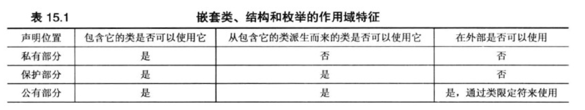

<h1 align="center">第 15 章 友元、异常和其它 学习笔记</h1>

- [1. 友元](#1-友元)
- [2. 嵌套类](#2-嵌套类)
- [3. 异常](#3-异常)
  - [3.1 返回abort()](#31-返回abort)
  - [3.2 程序错误码](#32-程序错误码)
  - [3.3 异常机制](#33-异常机制)
  - [3.4 异常规范和C++11](#34-异常规范和c11)
  - [3.5 栈解退](#35-栈解退)
  - [3.6 其它异常特性](#36-其它异常特性)
  - [3.7 exception类](#37-exception类)
  - [3.8 异常丢失](#38-异常丢失)
- [4. RTTI](#4-rtti)
  - [4.1 `dynamic_cast` 运算符](#41-dynamic_cast-运算符)
  - [4.2 `typeid` 运算符 和 `type_info` 类](#42-typeid-运算符-和-type_info-类)
- [5. 类型转换运算符](#5-类型转换运算符)

## 1. 友元
友元函数用于类的扩展接口   中，类中不仅可以使用友元函数，也可以将类作为友元。

友元类的所有方法都可以访问原始类的`私有成员`和`保护成员`。

在一个类中将另一个类声明为友元。
```cpp
friend class Remote
```
友元声明可以位于公有、私有或者保护部分，其所在的位置无关紧要。

如果要将`友元类`中的特定的`类成员`解析作为`原始类`的`友元`，无需将整个类作为友元。
```cpp
class Tv
{
    friend void Remote::set_chan(tv & t, int c);
    ...
};
```
将类声明为友元时，需要注意：将类声明放在包含友元类的前面。 这种方法称为 **`前向声明（forward declaration）`** 。

```cpp
class Tv;  // 前向声明
class Remote {...};

class Tv {...};
```
`内联`函数的链接性是`内部`的，意味着函数定义必须在`使用函数的文件`中。也可将定义放在`实现文件`中，但必须删除 `关键字inline`，此时的链接性是`外部`的。


将类成为彼此的友元的实现方式。例如：
```cpp
class Tv
{
    friend class Remote;
    public:
        void buzz(Remote & r);
        ...
};
class Remote
{
    friend class Tv;
    public:
        void Bool volup(Tv & t) {t.volup();}
};
inline void Tv::buzz(Remote & r)
{
    ...
};
```

## 2. 嵌套类
在C++中，可以将类声明放在另一个类中。在另一个类中声明的类被称为 **`嵌套类（nested class）`**。

当类声明位于公有部分时，才能包含类的外面使用嵌套类，而且必须使用作用域解析运算符。

对类进行嵌套和组合不同。
- 组合将`类对象`作为另一个类的`成员`。
- 对类进行嵌套`不创建类成员`，而是定义一种`类型`（类型仅包含嵌套类声明的类中有效）。

对类进行嵌套是为了实现另一个类，并避免名称冲突。

嵌套类的访问权限控制

- 嵌套类的`声明位置`决定了嵌套类的`作用域`，决定了程序的`哪些部分`可以创建其类的`对象`。
- 和其它类一样，嵌套类的公有部分、私有部分和保护部分控制了对类成员的访问。

嵌套类访问的两种方式：

- 作用域
    
    - 嵌套类的作用域为包含它的类，在类外部使用，则需要使用`类限定符`。

- 访问控制
  - 对嵌套类访问控制规则与常规类相同。
  
    类声明的位置决定了类的作用域可见性。
  - 类可见后，访问控制规则（公有、保护、私有、友元）将决定程序对嵌套类成员的访问权限。

## 3. 异常
异常是C++相对较新的功能，早期老编译器中可能会没有实现，但新的编译器中则是默认关闭了该特性。所以需要使用编译器选项来开启。

### 3.1 返回abort()
调用位于头文件`cstdlib（或stdlib.h）`的`Abort()` 函数。
  
典型实现：想标准错误（即cerr使用的错误流）发送消息 `abnormal program termination（程序异常终止）` ，然后 `终止程序` 。还返回一个随实现而异的值，告知OS（如果程序是由另一个程序调用，则告诉父进程），处理失败。

- `abort()` 是否刷新文件缓冲区（用于存储读写到文件中的数据的内存区域）取决于实现。
- `exit()`：会刷新文件缓冲区，则不显示消息。

一般情况下，显示程序的异常中断消息随编译器而不同。

### 3.2 程序错误码
一种比异常终止更灵活的方式：使用函数的返回值来指出问题。

任何数值都是有效的返回值，所以不存在可用于指出问题的特殊值。

一般使用`指针参数`或者`引用参数`来将`值返回`给`调用程序`，并使用函数的`返回值`来指出`成功`还是`失败`。

### 3.3 异常机制
C++异常是对程序运行过程中发生的异常情况的一种响应。

对异常的处理有3个组成部分：
- 引发异常
  - `关键字throw` 表示`引发异常`，后面`紧跟值`用来指出`异常特征`。
- 使用`处理程序`捕获异常
  - `关键字catch` 表示`捕获异常`，后面括号中紧跟`类型声明`来指出`异常处理程序要响应的异常类型`。其后的代码块则指出采取的措施。
- 使用 `try块`
  - 标识特定的异常`可能被激活的代码块`，后面紧跟`一个`或`多个catch块`。
  - 表面需要注意代码引起的异常。

```cpp
#include <iostream>
double hmean(double a,double b);

int main()
{
    double x,y,z;
    std::cout << "Enter tow number :";
    while (std::cin >> x >> y)
    {
        try{
            z = hmean(x,y); // 如果程序输入的值不对，则会使用catch块来对异常进行处理
        }
        catch (const char *s){
            std::cout << s << std::endl;
            std::cout << "Enter a new pair of numbers :";
            continue; // 结束while循环的剩余部分，重新从while语句开始
        }
        std::cout <<"Harmonic mean of " << x << " and " << y << " is " << z <<std::endl;
        std::cout << "Enter next set of number <q to quit> : ";
    }
    std::cout << "Bye !! \n";
    return 0;
}

double hmean(double a ,doubel b)
{
    if (a == -b)
    // throw 用于执行返回语句，会终止函数的执行
    // throw不是将控制权返回给调用程序，而是导致程序沿函数调用序列后退，直到找到包含try块的函数
        throw "bad hmean() arguments : a = -b not allowed ";
    return 2.0 * a * b / (a + b);
}
```

### 3.4 异常规范和C++11
异常规范是C++98中的一项功能，在C++11中已摒弃。但也需要了解：
```cpp
double harm(double a) throw(bad_thing); // 可能会抛出异常，只会抛出 bad_thing 类型的异常
double marm(double) throw(); // 不会抛出异常
```
`throw() `部分是异常规范，可能出现在`函数原型`和`函数定义`中，可包含`类型列表`，也可不包含。

异常规范的两个作用：
- 告知可能需要使用 **`try块`**。
- 让编译器添加执行运行阶段`检查代码`是否违反异常规范。

C++11中支持了一种特殊的异常规范：使用新增的 **`关键字noexcept`** 指出函数不会引发异常。
```cpp
double marm() noexcept; // 
```

### 3.5 栈解退
当函数调用出现异常而终止，则程序释放栈中的内存，但不会释放栈的第一个返回地址后停止，而是继续释放栈，直到找到第一个 try块 中的返回地址，这个过程叫 **`栈解退`**。

异常机制将负责释放栈中的自动变量。

### 3.6 其它异常特性
引发异常时编译器总是`创建一个临时拷贝`，即使异常规范和catch块中指定的是引用

引用作为返回值的原因：避免创建副本以提高效率。

如果有一个异常类继承层次结构，排序catch块的规则：将捕获位于`层次结构最下面`的异常类的`catch语句`放在`最前面`，将`捕获基类异常`的`catch语句`放在`最后面`。

如果不知道异常的类型，方法是省略号来捕获任何异常。

```cpp
catch () {/* statement */} // catch any type exception
```

如果可以预知一些异常类型，类似于switch语句的使用。

```cpp
try{
  duper();
}
catch(bad_3 &be)
{
  // statement
}
catch(bad_2 &be)
{
  // statement
}
catch(bad_1 &be)
{
  // statement
}
catch(bad_hmean &h)
{
  //statement
}
catch(...)
{
  // statement
}
```

### 3.7 exception类
C++异常的主要目的：设计容错程序时避免一些错误处理方式。

在C++中 `exception头文件`中定义了 `exception类`，类中的 `what() 虚拟成员函数`，会返回`一个字符串`，字符串的特征随实现而异。

```cpp
#include <exception>
// 派生多个异常来处理
class bad_hmean : public std::exception
{
  public:
    const char * what() {return "bad arguments to hmean()";}
    ...
};
class bad_gmean : public std::exception
{
  public:
    const char * what() {return "bad arguments to gmean() ";}
    ...
};

// 直接使用一个基类来处理
try {
  ...
}
catch(std::exception & e)
{
  cout << e.what() << std::endl;
}
```

C++定义的基于`exception`的异常类型

- `stdexcept`异常类
  - `头文件stdexcept`定义的其它几个异常类，例如：`logic_error` 和 `runtime_error类`，都是从`公有方式`从exception派生而来。
    ```cpp
    class logic_error : public exception {
      public:
        exception logic_error(const string& what_arg);
        ...
    };
    class domain_error : public exception {
      public:
        explicit domain_error(const string& what_arg);
        ...
    }
    ```
  - 这些类的构造函数接受一个string对象作为参数，参数提供了方法 `what()` 以 C风格字符串方式返回`字符数据`。

    - `logic_error` 派生出来用于报告错误类型的类还有：
      - 逻辑错误，`任何阶段`
      - `domain_error`：传递给函数的参数不在定义域内而引发异常
      - `invalid_error`：传递了一个意料之外的值
      - `length_error`：指出没有足够的空间来执行所需的操作。
      - `out_of_bounds`：用于指示索引错误。
    - runtime_error 类型派生出来的类：
      - 错误发生在`运行阶段`
      - range_error：不在函数允许的范围内，和上溢、下溢无关。
      - overflow_error：上溢。`整型`和`浮点型`都有可能。
      - underflow_error：下溢。要发生在`浮点数计算`。

  - `每一个类`都有自己的`构造函数`，使 `what()方法` 能够返回的字符串。

- bad_alloc异常和new
  - new 请求的内存`分配失败`，则会引发 `bad_alloc`的异常错误。
  - 数组中最为常见。

- 空指针和new
  - new 分配内存失败，则会返回一个`空指针`。也是从`exception类`派生而来。所以C++标准提供了用法：
    ```cpp
    int * pi = new (std::nothrow) int;
    int * pa = new (std::nowthrow) int[500];
    ```
### 3.8 异常丢失
异常被引发后，会导致问题的两种情况：
- **`意外异常（unexpected exception）`**：在带异常规范的函数中引发，但必须与规范列表中的某种异常匹配。
  - 可以通过调用 `terminate()`（默认行为）、`abort()` 或者 `exit()` 来终止程序
  - 引发异常

- **`未捕获异常（uncaught exception）`**：在没有try和catch块外抛出的异常。
  - 不会导致程序立即异常停止。

**引发异常(第二种选择)的结果取决于`unexpected_handler函数`所引发的异常以及引发意外异常的函数的异常规范**：
- 如果新引发的异常与原来的异常规范 **`匹配`**，则程序将从那里开始进行正常处理，即寻找与新引发的异常匹配的catch块。基本上是**`用预期的异常取代意外异常`**。
- 如果新引发的异常和原来的异常规范 **`不匹配`**，切异常规范中没包括 `std::bad_exception` 类型，则程序调用 `terminate()`。`bad_exception` 是从 `exception类`派生而来。声明位于`头文件execption`中。
- 如果新引发的异常与原来 **`不匹配`**，且`原来的异常规范`中包含 `std::bad_exception` 类型，则不匹配的异常被 `std::bad_exception` 异常所取代。

如果要捕获所有的异常，则方法如下：、
```cpp
// 1. 确保已声明异常头文件
#include <exception>
using namespace std;

// 2. 设计替代函数，将意外异常转换为 bad_exception 异常
void myexception()
{
  throw std::bad_exception {};
}

// 3. 将bad_exception 类型包含在异常规范中，并添加到catch块中
double Argh(double,double) throw(out_of_bounds, bad_exception);
...
try {
  x = Argh(a,b);
}
catch (out_of_bounds & ex)
{
  ...
}
catch (bad_exception & ex)
{
  ...
}
```

## 4. RTTI
**`RTTI（Runtime Type Identification，运行阶段类型识别）`**，C++11中新添加的新特性。

RTTI旨在为程序在运行阶段`确定对象的类型`提供一种标准方式。

**`RTTI只适用于包含虚函数的类`**。

C++中支持RTTI的3个元素
- `dynamic_cast`运算符：将使用一个指向基类的指针类生成一个指向派生类的指针，否则该运算返回0 ---- 空指针。
- `typeid`运算符：返回一个指出对象的类型的值
- `type_info`结构：存储有关特定类型的信息。

只有将RTTI用于包含`虚函数`的`类层次结构`，原因在于只有对于这种类层次结构，才应该将派生类对象的地址赋给基类指针。


### 4.1 `dynamic_cast` 运算符
是最常用的RTTI架构。

只有指针类型与对象的类型（或对象的直接或间接基类的类型）相同的类型转换才一定是安全的。

语法格式：
```cpp
Superb *pm = dynamic_cast<Superb *pg> // 如果类型检查转换成功，则直接返回并进行赋值，否则得到一个空指针。
```

即使编译器支持RTTI，但在默认情况下，也可能是关闭该特性。

`dynamic_cast` 也可以用于引用。因为没有与空指针对应的引用值，所以无法使用特殊的引用值来指示失败。所以失败了，就会引发 `bad_cast` 的异常。
```cpp
try {
  Superb & rs = dynamic_cast<Superb &> (rg);
  ...
}
catch (bad_cast &) {
  ...
};
```
### 4.2 `typeid` 运算符 和 `type_info` 类
`typeid` 运算符使能够确定`两个对象`是否为`同种类型`。接受两种参数：
- 类名
- 结果为对象的表达式

`typeid` 运算符返回一个`type_info对象的引用`，其中 `type_info` 在`头文件 typeinfo`中定义的一个类。

`typ_info类` 重载 `==` 和 `!=` 运算符，以便于使用对类型进行比较。

示例
```cpp
typeid(Magnificent) == typeid(*pg) // 将pg指向一个 Magnifgicent 对象，表达式返回结果为True，否则为False。
```

`typeid`测试用来`选择一种操作`，因为操作不是类的方法，所以 ~~不能通过类指针来调用它~~。

## 5. 类型转换运算符
假设 High 和 Low 是两个类。


通过4种类型转换运算符来使得转换过程增加规范。
- dynamic_cast
  - 能够在类层次结构中进行向上转换，而不允许其他转换。
    ```cpp
    dynamic_cast <type_name> (expression) // 判断expression是否可以转换成为 type_name 类型
    ```
- const_cast
  - 用于执行`只有一种用途的类型转换`，即改变值为`const`或者`volatile`。语法和 dynamic_cast相同
    ```cpp
    // 语法格式
    const_cast <type_name> (expression) // 删除const属性，使变成可修改对象
    // 示例
    High bar;
    const High *pbar = &bar;
    High *pb = const_cast <High *> (pbar); // 让*pb可成为一个用于修改bar对象值的指针。删除const属性
    ```
- static_cast
  - type_name 和 expression互相隐式转换为其所属的类型时，转换才合法，否则将出错。
    ```cpp
    static_cast <type_name> (expression)
    ```

- reinterpret_cast
  - 转换适用于依赖于实现的底层编程技术，具有不可移植性。
  - 不做任何处理，也不能删除const属性
  - 不支持所有的类型转换
    - 可以将指针类型转换为足以存储指针表示的类型，但不能将指针转换为更小的整型或者浮点型。
    - 不能将函数指针转换为数据指针。
  ```cpp
  reinterpret_cast <type_name> (expression)
  ```
