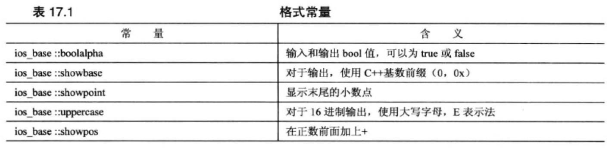
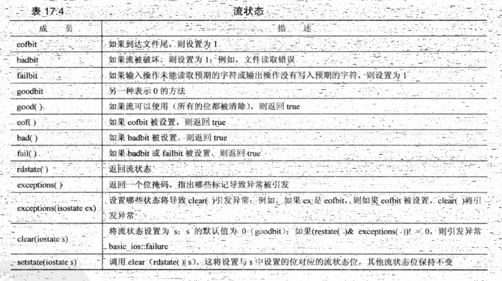

<h1 align="center">第 17 章 输入、输出和文件 学习笔记</h1>

- [1. C++输入和输出概述](#1-c输入和输出概述)
  - [1.1 流、缓冲区和`iostream`](#11-流缓冲区和iostream)
  - [1.2 重定向](#12-重定向)
- [2. 使用cout进行输出](#2-使用cout进行输出)
  - [2.1 修改显示时使用的计数系统](#21-修改显示时使用的计数系统)
  - [2.2 调整字段宽度](#22-调整字段宽度)
  - [2.3 填充字符](#23-填充字符)
  - [2.4 设置浮点数的显示精度](#24-设置浮点数的显示精度)
  - [2.5 打印末尾的0或小数点](#25-打印末尾的0或小数点)
  - [2.6 setf()](#26-setf)
  - [2.7 头文件iomanip](#27-头文件iomanip)
- [3. 使用cin进行输入](#3-使用cin进行输入)
  - [3.1 `cin>>`如何检查输入](#31-cin如何检查输入)
  - [3.2 流状态](#32-流状态)
  - [3.3 其他istream类方法](#33-其他istream类方法)
  - [3.4 其他istream方法](#34-其他istream方法)
- [4. 文件输入和输出](#4-文件输入和输出)
- [5. 内核格式化](#5-内核格式化)

## 1. C++输入和输出概述
C实现自带了一个标准函数库，C++自带了一个标准类库。标准类库是一个非正式的标准，是由头文件 `iostream` 和 `fstream` 中定义的类组成。


### 1.1 流、缓冲区和`iostream`
C++程序把`输入`和`输出`看作字节流。
- 输入时
  - 程序从`输入流`中抽取`字节`
- 输出时
  - 程序把`字节`插入到`输出流`中

输入流中的字节可能来自键盘、存储设备或者其它程序。

输出流中的字节可以流向屏幕、打印机、存储设备或者其它程序。

管理输入包含两步：
- 将流与输入去向的程序关联起来
- 将流与文件连接起来。

通常，通过使用缓冲区可以高效地处理输入和输出。**`缓冲区是用作中介的内存块`** 。它将信息从设备传输到程序或从程序传输给设备的 **`临时存储工具`**。

头文件iostream 中包含了一些专门设计用来实现管理流和缓冲区的类。
- streambuf类 为缓冲区提供了内存，并提供了用于填充缓冲区，访问缓冲区内容，刷新缓冲区和管理缓冲区内存的类方法。
- ios_base类 表示流的一般特征，如是否可读取，是二进制还是文本流等。
- ios类基于ios_base，其中包含了一个指向streambuf对象的指针成员。
- ostream类 是基于ios类派生而来，提供输出方法。
- istream类 也是基于ios类派生而来，提供输入方法。
- iostream是基于 istream 和 ostream类，基础了输入和输出方法。

在程序中包含 iostream 文件，将自动创建8个流对象（4个用于窄字符流，4个用于宽字符流）
- 处理窄字符流 ----- 处理 char_t 类型
  - `cin对象`对应于标准输入流。
  - `cout对象`与标准输出流相对应。
  - `cerr对象`与标准错误流相对应，用于显示错误信息。流不会被缓冲。
  - `clog对象`对应标准错误流。流会被缓冲。

- 处理宽字符流 ----- 处理 wchar_t 类型 
  - wcin对象
  - wcout对象
  - wcerr对象
  - wclog对象

### 1.2 重定向
标准输入和输出流通常连接键盘和屏幕。

- **`输入重定向（<）`**
- **`输出重定向（>）`**

## 2. 使用cout进行输出
C++将输出流看作字节流。平台不同，则读取字节流会有差异。

ostream类最重要的任务之一：将`数据内部表示（二进制位模式）`转换为由`字符字节`组成的输出流，使能够直接翻译成二进制数据。

在C++中，`<< 运算符`的默认含义是`按位左移`运算符。但ostream类重新定义了 << 运算符，方法将其重载为输出（也称为 **`插入运算符`**）。

插入运算符的所有化身的返回类型都是 `ostream&`。原型格式如下：
```cpp
ostream & operator<<(type);
```

除了 operator<<() 函数外，ostream类还提供 `put()` 方法和 `write()` 方法。前者用于显示`字符`，后者用于显示`字符串`。

- `put()`方法
    - 原型如下：
    ```cpp
    // 参数：提供要显示的字符
    ostream &put(char);
    ```

- `write()`方法
    - 原型如下：
    ```cpp
    // 第一个参数：提供要显示字符串的地址
    // 第二个参数：指出要显示多少个字符
    basic_ostream<charT, traits> & write(const char_type* s, streamsize n);
    ```
    - ⚠️注意点：write() 方法不会在遇到空字符时自动停止打印字符，而只是打印指定数目的字符，即使超出字符串的边界。

都是类成员函数，需要有调用对象
```cpp
cout.put('w');
cout.write("Kansas",6);
```

`ostream类`对`cout对象`处理的输出进行`缓冲`，所以输出不会立即发送到目标地址，而是被存储到缓冲区中，直到缓冲区填满。然后程序将刷新缓冲区，把内容发送出去，并清空缓冲区，以存储新的数据。

如果实现不能在所希望时刷新输出，可以使用强制刷新的两个控制符之一：
- `flush`：刷新缓冲区
- `endl`：刷新缓冲区，并插入一个换行符

```cpp
cout << "Hello, good-looking !" << flush;
cout << "Wait just a moment, please ." << endl;
```

ostream插入运算符将值转换为文本格式。在默认情况下，格式化值的方式如下：
- `char值`：如果代表的是可打印字符，则将被作为一个字符显示在宽度为一个字符的字段中。
- `数值整型`：将以十进制方式显示在一个刚好容纳该数字的字段中。
- `字符串`：显示在宽度等于该字符串长度的字段中
- `浮点类型`：浮点类型被显示为6位，末尾的0不显示
  - 数字以`定点表示法`显示还是`科学计数法`表示，取决于值。
  - 当指数大雨6或者小于等于-5时，将使用科学计数法。
  - `字段宽度`恰好容纳`数字`和`负号`。

### 2.1 修改显示时使用的计数系统
ostream类从ios类派生而来，而ios从ios_base类派生而来。ios_base类存储了描述格式状态的信息。

通过使用 ios_base 的成员函数，可以控制字段和小数位数。。因ios_base类时ostream的间接基类，可以将其方法用于ostream对象。

要控制整数以`十进制`、`十六进制`还是`八进制`显示，可以使用 `dec`、`hex` 和 `oct` 控制符。
```cpp
dec(cout);   // 十进制，等价于  cout << dec;
hex(cout);   // 十六进制，等价于 cout << hex;
oct(cout);   // 八进制，等价于 cout << oct;
```
使用上述设置后，程序将以十六进制形式打印整数值，直到将格式状态设置为其它选项为止。注意：控制符不是成员函数，不必通过对象来调用。

### 2.2 调整字段宽度
由于数字的字段宽度不同，所以可以使用 `width 成员函数`将长度不同的数字放到宽度相同的字段中。方法原型为：
```cpp
int width(); // 返回字段宽度的当前设置
int width(int i); // 将字段宽度设置为 i 个空格，并返回以前的字段宽度值
```
`width() `方法只影响将显示的下一个项目，然后字段宽度将恢复为默认值。

C++永远不会`截短`数据，会`增宽`字段，以`容纳`该数据。**`C/C++的原则`** ：显示所有的数据比保持列的整洁更重要，C++视`内容重于形式`。

```cpp
int main()
{
  cout.width(5);
  cout << "N" << ":";
}
```

### 2.3 填充字符
在默认情况下，`cout` 使用`空格填充`字段中`未被使用的部分`，可以使用 `fill()` 成员函数来改变填充字符。

```cpp
cout.fill('*');
```
对于检查结果，防止接收方添加数字很有用。

### 2.4 设置浮点数的显示精度
`浮点数精度`的含义取决于`输出模式`。在默认模式下，指的是显示的总位数。

在定点模式和科学模式下，`精度`指的是`小数点后的位数`。

C++中的默认精度为`6位`（末尾的0将不显示），`precision()` 成员函数使能够选择其他值。
```cpp
cout.precision(2); // 设置精度为2，设置后一直有效，只有重新设置会被重置
```

### 2.5 打印末尾的0或小数点
使用 `setf()` 函数，能够控制多种格式化特性：
```cpp
cout.setf(ios_base::showpoint); // 默认精度是6位
```
使用默认的浮点格式时，会将导致末尾的0被显示出来。

### 2.6 setf()
ios_base类有一个受保护的数据成员，其中的各位分别控制着格式化的各个方面。

对于setf() 函数，有两个原型：
```cpp
// 此为原型1
fmtflags setf(fmtflags);
```
`fmtflags` 是 `bitmask类型`的`typedef名`，用于存储格式标记。

其中ios_base定义了代表位置的常量，其中一些定义为：



> 因都是 ios_base类中定义，所以使用时，必须加上`作用域解析运算符`。

`bitmask` 类型是一种用来存储各个位值的类型。可以是整型、枚举，也可以是STL bitset容器。

在C++标准中，定点表示法和科学表示法都有两个特征：
- 精度指的是小数位数，而不是总位数
- 显示末尾的0

第二种 `setf()` 函数的原型：
```cpp
// 第一个参数：包含所需设置的fmtflags值
// 第二个参数：指出要清除第一个参数中的那些位
fmtflags setf(fmtflags,fmtflags);
```
例如，要左对齐，则使用：
```cpp
ios_base::fmtflags old = cout::setf(ios::left, ios::adjustfield);
```
如果要恢复以前的设置，则使用，
```cpp
cout.setf(old,ios::adjustfield);
```
在调用setf() 后可以通过unsetf() 来消除，unsetf() 的原型如下：
```cpp
// mask 是位模式，mask中是所有的位都设置为1，将使得对应的位被复位
void unsetf(fmtflags mask);
```

[实际代码示例](./setf2.cpp)

### 2.7 头文件iomanip
C++ 在头文件 `iomanip`中提供了一些控制符。其中3个最常用的控制符分别是：
- `setprecision()`：设置精度
  - 接受一个指定精度的整数参数

- `setfill()`：填充字符
  - 接受一个指定填充字符的char参数

- `setw()`：字符宽度
  - 接受一个指定字段宽度的整数参数

## 3. 使用cin进行输入
cin对象将标准输入表示为字节流，通常情况下，通过键盘来生成这种字符流。

### 3.1 `cin>>`如何检查输入
不同版本的抽取运算符查看输入流的方法都是相同的。他们跳过`空白（空格、换行符和制表符）`，直到遇到`非空白字符`。

- 单字符模式
  - `>>` 运算符将读取该字符，将它放置到指定的位置
- 其他模式
  - `>>` 运算符将读取一个指定类型的数据。

### 3.2 流状态
流状态（被定义为isolate类型，而isolate是一种bitmask类型）。由3个ios_base元素组成：
- `eofbit`：表示到达文件末尾
- `badbit`：遇到无法诊断的失败破坏流
- `failbit`：未能读取到预期的字符

其中的每个元素都是一位，可以是`1（设置）`或`0（清除）`。当3个状态位都被设置为0时，说明一切顺利。



`clear()` 和 `setstate()` 类型，都是重置状态，但采取的方式不同。
- `clear()`：将状态设置为它的参数
- `setstate()`：只影响其参数中设置的位置，而不会影响其他位。

exceptions() 方法返回一个位字段，包含3位，分别对应于`eofbit`、`failbit`、`badbit`。修改流状态涉及`clear()` 或 `setstate()` ，都将使用`clear()`。当前状态中的对应位也被设置，则`clear()` 将引发 `ios_base::failure` 异常。如果两个值都设置了`badbit`，将发生这种情况。

`exceptions()` 的默认设置为 `goodbit`，没有引发异常，但重载的 `exceptions(isolate)` 函数使得能够控制其行为。

```cpp
cin.exceptions(badbit);
```

位运算符OR 使能够指定多位。

```cpp
cin.exceptions(badbit | eofbit);
```

设置流状态位将对后面的输入或者输出关闭，直到位将被清除。

```cpp
while (cin >> input)
{
  sum += input;
}
// 可以在此处增加 clear() 来清除流状态
//cout.clear();
cin >> input; // don't work
```
如果希望程序在流状态位被设置后能够读取后面的输入，就必须将流状态设置为良好。可以通过调用 `clear()` 来实现。导致输入循环终止的不匹配输入仍留在输入队列中，程序必须跳过它。

### 3.3 其他istream类方法
- 方法`get(char&)` 和 `get(void)` 提供不跳过空白的单个字符输入功能
- 函数 `get(char*, int, char)` 和 `getline(char*, int, char)`在默认情况下读取整行而不是一个单词。

都称为 **`非格式化输入函数`**。都只是读取字符输入，而不会跳过空白，也不进行数据转换。

在istream类中的`get()` 有两种原型格式：

```cpp

```


### 3.4 其他istream方法


## 4. 文件输入和输出


## 5. 内核格式化

